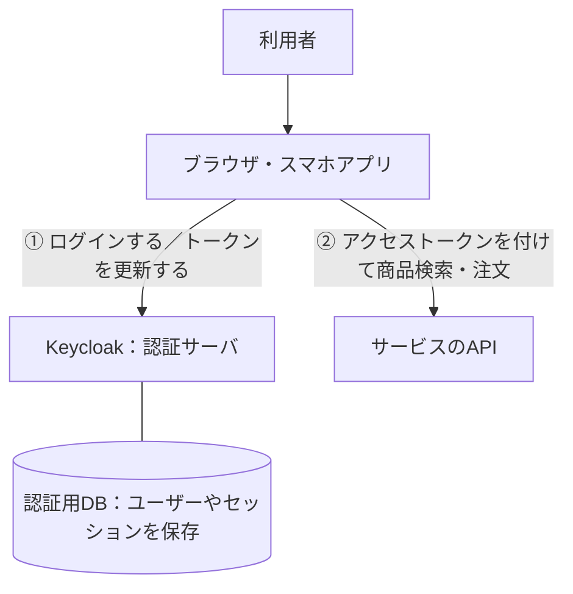
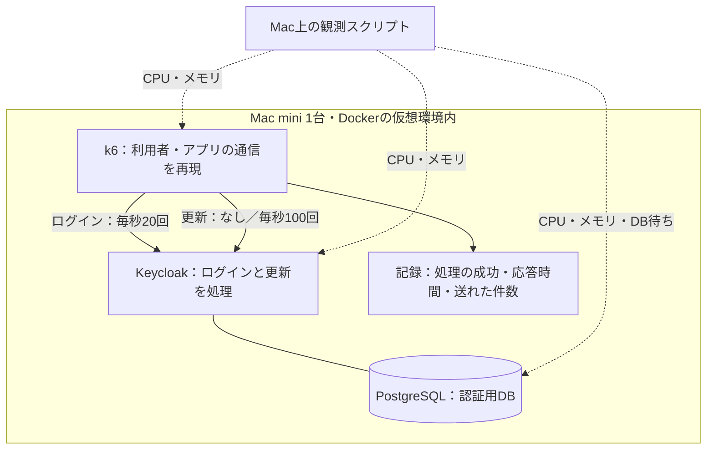
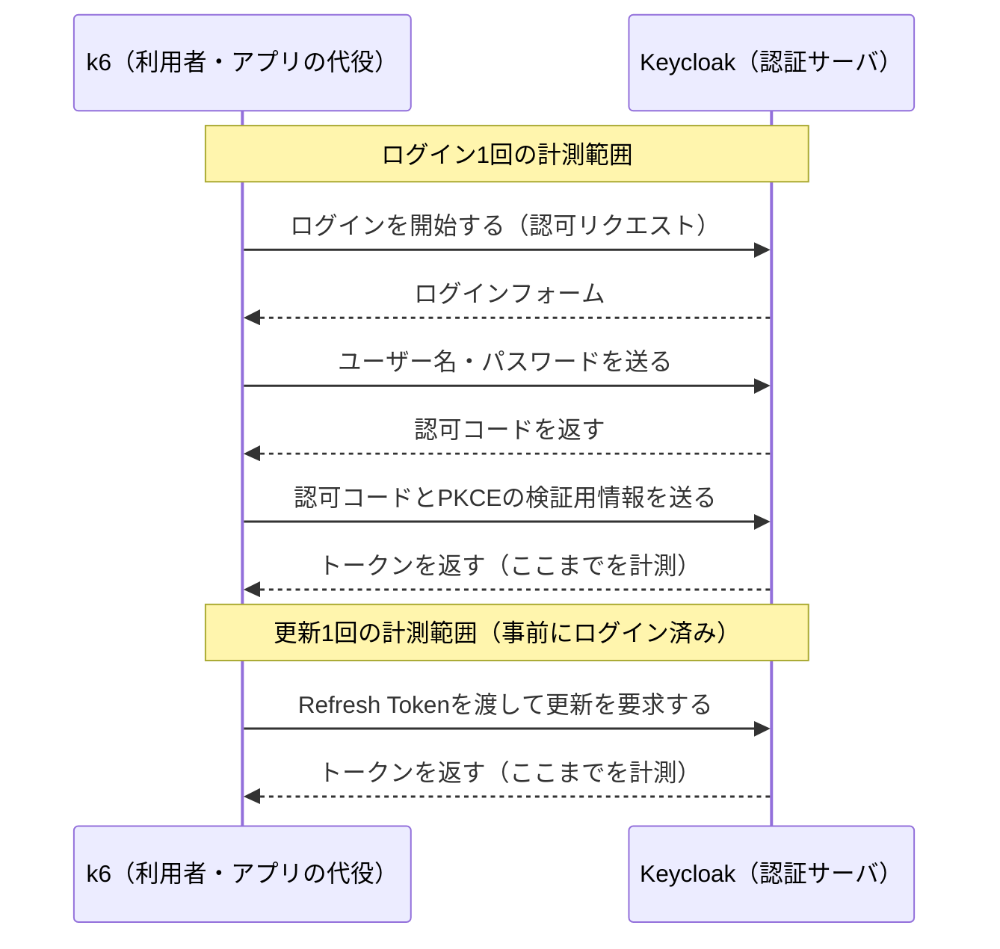
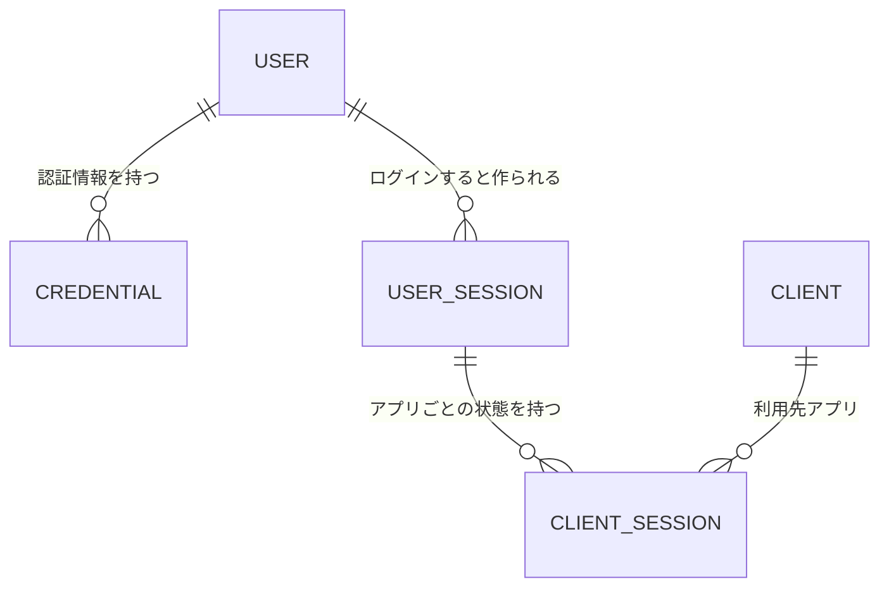
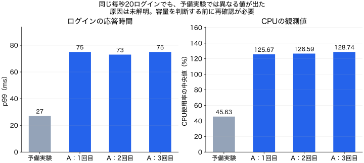

# ログインの負荷試験だけで大丈夫？Keycloakでトークン更新も測ってみた

たとえば、セール開始時にアクセスが集まるECサイトを作っているとします。「毎秒20回のログインを処理しても遅くならない」と確認できたら、認証サーバの負荷試験は終わりでしょうか。

まだ確かめたいことがあります。**すでにログインしている利用者のアプリも、認証サーバへトークンの更新を要求する**からです。新しく入ってくる人の処理に、この更新処理が重なります。

そこで、OSSの認証サーバであるKeycloakをMac miniで動かし、ログインだけの場合と、ログインに更新を加えた場合を比べました。

結果は、**ログインの応答時間はほぼ同じでも、CPU使用率の観測値には差がある**というものでした。実務でまず行いたいのは、**ログインと更新を同時に流し、応答時間とCPU使用率を一緒に確かめること**です。以下で、その比較方法と結果の読み方を説明します。

## まず全体像：Keycloakは何を担当するのか

**Keycloakは、アプリの代わりにログインを受け付け、利用者を確認してトークンを発行するOSSの認証サーバです。** ECサイトなら、商品検索や注文を処理するAPIとは別の役割を持ちます。

今回想定するサービスは、次の構成です。矢印は要求の向きを表しています。



Keycloakから受け取る**アクセストークン**は、アプリがAPIを呼ぶときに提示するものです。有効期限があるため、**Refresh Token**を使う構成では、アプリはそれをKeycloakへ渡し、新しいアクセストークンを受け取ります。この処理を、この記事では「更新」と呼びます。

ここで気になるのが、①の負荷です。新しくログインする利用者が少なくても、すでにログイン済みのアプリが更新を続けていれば、Keycloakには仕事が来ます。**ログインだけを試しても、この二つが重なったときに余裕があるかはわかりません。**

本稿は、OIDCを利用するサービスの開発者向けです。OIDCはOAuth 2.0を土台とする認証の仕組みで、ここでいう更新はOAuthのRefresh Token処理です。仕様は [OIDC Core](https://openid.net/specs/openid-connect-core-1_0.html#CodeFlowAuth) と [OAuth 2.0 Section 6](https://www.rfc-editor.org/rfc/rfc6749.html#section-6) にあります。

## この実験では、利用者とアプリの代わりにk6から要求を送る

実際に大勢の人を集める代わりに、**負荷試験ツールのk6が、ログインと更新のHTTP通信を繰り返します。** KeycloakとPostgreSQLは実物を動かします。上の図の①を試す実験で、②の商品検索や注文のAPIは用意していません。



**同じ件数のログインに更新を加えたとき、ログインが遅くなるか、CPU使用率がどう変わるか**を比べます。図の2本の要求は、混合条件では同時に流します。ログインが終わるたびに必ず1回更新する、という試験ではありません。

### ログイン1回、更新1回は、どこからどこまでか

k6が実際に行う通信を並べると、二つの処理の違いがわかります。



ログインは **Authorization Code Flow + PKCE S256** を通します。PKCEは、認可コードを交換する相手を検証するための仕組みです。この構成ではログイン1回に通常3 HTTPリクエスト、更新1回に1 HTTPリクエストが必要です。「毎秒20ログイン」は「毎秒20 HTTPリクエスト」とは異なります。

ブラウザ画面の描画時間や、人がパスワードを入力する時間は含めません。k6から見た、認証の一連の通信の所要時間を測ります。

### 更新のために、どんなデータを準備するのか

更新には、すでにログインしている状態が必要です。そのため、架空ユーザーだけでなく、事前にログインしてセッションを作ります。データの関係を簡略化すると次のようになります。



USERは利用者、CREDENTIALはパスワードなどの認証情報、USER_SESSIONはログイン状態、CLIENTはKeycloakに登録したアプリを表します。これは関係を説明する概念ER図で、Keycloakの物理テーブル図ではありません。

架空ユーザーは1,000人です。各条件で200セッションを事前作成しますが、ログインが成功すればセッションは増えます。ウォームアップ後の状態まで全条件で同じという意味ではありません。更新を担当する負荷ツール内の各仮想ユーザーは、独立したRefresh Tokenを持ち、更新のたびに返されたトークンへ差し替えます。

## 実験：同じログイン件数で、更新の有無を変える

中心となる比較は、A「ログインだけ」とB「ログインに更新を加える」です。参考としてC「更新だけ」も測りました。各条件で3回ずつ実行しています。

| 条件 | ログイン | 更新 | 確かめること |
|---|---:|---:|---|
| A：ログインだけ | 毎秒20回 | なし | 比較の基準 |
| B：両方を同時に流す | 毎秒20回 | 毎秒100回 | 更新を加えたときの違い |
| C：更新だけ（参考） | なし | 毎秒100回 | 更新処理そのものの負荷 |

この「毎秒20回・100回」は、低い件数から試して選んだ実験条件です。Keycloakが処理できる最大値ではありません。

測るものは、次の3つです。

- **成功するか。** 実行したログインと更新が何件成功したか。
- **遅くなるか。** ログインと更新の応答時間を見る。ここではp99、つまり「処理の99%がこの時間以内に終わる」という境目を使う。
- **資源をどれだけ使うか。** Keycloak、DB、負荷を送るツールのCPU・メモリを観測する。

予定した件数を送れていることも確認します。負荷を送るツールが先に詰まり、要求を減らしてしまった状態で「サーバは速い」と判断しないためです。

### 構成と測定時間

実験したのはApple M4・メモリ24GBのMac miniです。Dockerの仮想環境に4 CPUと約12GBを割り当てました。

| 構成要素 | バージョン | 割り当て上限 |
|---|---|---|
| Keycloak | 26.7.3 | 2 CPU・3GB |
| PostgreSQL | 17.6 | 1 CPU・2GB |
| k6（負荷を送るツール） | 1.8.1 | 1 CPU・2GB |

実験は2026年9月12日に行いました。各回で実験用DBを初期化しました。起動直後の影響を減らすために60秒間負荷を流してから、続く180秒間を測定しました。通信はDocker内部のHTTPです。外部の認証サービスや多要素認証（MFA）は含めていません。数値の集計方法は末尾にまとめました。

## 結果：ログインの速さだけでは、CPUの違いが見えなかった

まず、各条件の3回の結果から真ん中の値（中央値）を取り、比較します。**CPUの100%は1コア相当で、今回のKeycloakの上限は200%です。**

| 条件 | ログインのp99 | 更新のp99 | KeycloakのCPU使用率 |
|---|---:|---:|---:|
| A：ログインだけ | **75ms** | — | **約127%** |
| B：両方を同時に流す | **76ms** | 6ms | **約146%** |
| C：更新だけ（参考） | — | 5ms | 約30% |

AとBのログインp99は75msと76msで、差は小さい値でした。3条件とも、実行した処理は全件成功し、予定した処理を開始できなかった件数も0でした。

一方、CPUの観測値は126.59%から145.75%へ、約19ポイント増えています。**応答時間の数字だけでは、この違いは読み取れません。**


図の各点は1回の実験、横線は3回の中央値です。点を残しているのは、1回だけの結果で判断しないためです。CPUの集計方法など、数値の詳細は末尾の補足に記載しています。

なお、監視データの収集エラーがBとCの各1回で1件ずつありました。認証処理の全件成功と、監視データの完全性は別です。また、後述する予備実験との大きな差も残るため、このCPU差をすべての環境へ当てはめることはできません。

## では、自分のサービスではどうすればよいか

今回の結果だけで「CPUを増やすべき」とは判断できません。まず行うのは、**今のログイン試験に、自分のサービスで発生する更新を加えて測ること**です。

### 1. 更新が何回発生するかを見積もる

ログイン件数に加えて、「実際に更新を行っているセッション数」と「更新の間隔」を確認します。セッションはアプリや端末ごとのログイン状態を指し、1人が複数持つ場合もあります。

たとえば、30,000セッションがそれぞれ300秒に1回更新するなら、平均は次の値です。

```text
30,000セッション ÷ 300秒 = 毎秒100回の更新
```

これは計算例で、今回30,000セッションを作ったわけではありません。アプリが使われていない間は更新しないなど、クライアントの挙動で件数は変わります。実際のログがあれば、平均だけでなく短い時間帯のピークも確認します。

### 2. ログイン単独と、更新を加えた試験を比べる

先に「何ms以内に応答し、何%以上成功してほしいか」を決めます。検証環境で、ログイン件数、サーバのCPU・メモリ設定、測定時間を揃えます。その同じログイン負荷に、更新の負荷を加えて比べます。成功率と応答時間に加えて、CPU・メモリ、DB待ちも同時に見ます。

一度の結果で決めず、実行順を入れ替えて複数回測ります。今回も各条件で3回測り、速さだけではわからないCPUの違いを確認しました。

### 3. 結果に応じて、次に確かめることを決める

| 測定で起きたこと | 次に行うこと |
|---|---|
| 応答は速いがCPU使用率が高くなった | 検証環境で更新件数を段階的に増やし、目標の応答時間や成功率を守れる範囲を調べる |
| 応答が遅くなり、CPUやDB待ちも増えた | どこで待っているかを調べ、原因に対応する設定・構成を一つずつ変えて再測定する |
| ログインや更新の失敗が増えた | エラーの種類を確認し、トークンの扱い・タイムアウト・サーバ側の拒否など、失敗の原因を切り分ける |
| 負荷を送るツールが予定件数を送れない | まず試験が成立する環境を整える。サーバの限界と決めつけない |

サーバの増設や設定変更は、その後の判断です。今回の「約19ポイント」をそのまま足して必要台数を算出することはできません。

## この実験で、まだ答えが出ていないこと

### 同じログイン件数なのに、予備実験では大きく違う値が出た

負荷を少しずつ上げて条件を選ぶ予備実験では、毎秒20ログインでp99が27ms、CPU中央値が45.63%でした。Aの3回の測定では、同じ入力件数でp99が73〜75ms、CPUが125.67〜128.74%です。



この理由は未解明です。予備実験は未コミットの修正を含む時点、本比較は同じコミットのコードで行ったという違いもあります。公開された集約値だけでは、実行条件の差を完全には確かめられません。

今回の比較表には、A・B・Cでそれぞれ記録した3回すべてを使いました。予備実験の良い値だけを採用せず、その存在も隠していません。**容量を詳しく見積もる前に、この差がなぜ出たかを確認する必要があります。**

### 更新が短時間に集中したときの限界

追加で、更新件数を0〜毎秒200回の間で変動させ、平均を毎秒100回に保つ実験も3回行いました。ログインp99の中央値は78msで、認証処理は全件成功しました。

ただし、これは15秒ごとに100→200→100→0→100回/秒と滑らかに変える波です。一斉更新のような瞬間的な集中や、サーバが処理しきれなくなる境目までは調べていません。[追加実験の結果と時系列](../results/final-report.md#5-更新集中の比較)を別途公開しています。

また、今回の測定は1台のMacで各回180秒です。本番のTLS、MFA、外部IdP、障害時の切り替え、長時間の運転は別に確かめる必要があります。

## 試してみるには

コードと詳細な手順は [oidc-load-lab](https://github.com/higuuu/oidc-load-lab) にあります。Docker Desktop、Python 3.10以上、Node.js 22以上を用意し、まず1回のログインと更新が通るかを確認します。

```sh
git clone https://github.com/higuuu/oidc-load-lab.git
cd oidc-load-lab
git checkout 10fe2ac519ff23fd4505907040a37f35be854f4f
python3 scripts/lab.py init
python3 scripts/lab.py check
python3 scripts/lab.py run smoke
```

この確認が成功したら、低い件数から負荷試験を始めます。以下はAとBの比較を、毎秒1ログイン、毎秒5更新で試す例です。

```sh
python3 scripts/lab.py run login --login-rate 1
python3 scripts/lab.py run mixed --login-rate 1 --refresh-rate 5
```

`run` は毎回、この実験専用のDBを削除・初期化します。実データは入れないでください。結果の集計、負荷を増やす順序、終了時の停止方法は[実行手順](../README.md)にまとめています。

## 集計方法と検証範囲の補足

ここからは、図で示した測定から表の数値をどう求めたかと、確認範囲の補足です。

表のCPUは約7秒ごとの観測値から各回の中央値を求め、さらに3回の中央値を取った値です。p99も各回で求めた値の中央値で、全リクエストをまとめたp99ではありません。時間の計測はミリ秒単位なので、75msと76msの1ms差に統計的な意味があるとは主張していません。

測定では、予定した件数で処理を開始するk6の [open model](https://grafana.com/docs/k6/latest/using-k6/scenarios/concepts/open-vs-closed/) を使いました。本比較ではログインが各回3,600〜3,601件、更新が18,000〜18,001件です。成功率は実際に開始した件数を分母にしています。

比較用の合格基準は、成功率99%以上、ログインp99が2,000ms未満、更新p99が500ms未満、開始できなかった予定処理が0件です。これは実験用の基準で、本番サービスの目標値ではありません。観測されたk6のCPU最大値は7.30%で、この範囲では負荷を送るツールが先に詰まった兆候はありませんでした。

負荷を送るk6もKeycloakと同じ仮想環境で動くため、その影響を完全には分離できていません。

公開しているのは集約値とコードです。トークンや資格情報を含み得る生ログは公開していないため、記事化の確認は公開値の再集計までです。ID Tokenの署名検証も生成器では行っておらず、本番クライアントの実装例としては使えません。

追加実験3回を含む全12回の数値は[再集計表](generated-results.md)、失敗を含む23回の履歴は[実験台帳](../results/experiment-ledger.md)、確認範囲は[レビュー記録](pr1-review.md)にあります。Keycloakの[公式ベンチマーク](https://www.keycloak.org/2025/10/keycloak-benchmark)でも、ログインと更新を分けて測っています。
