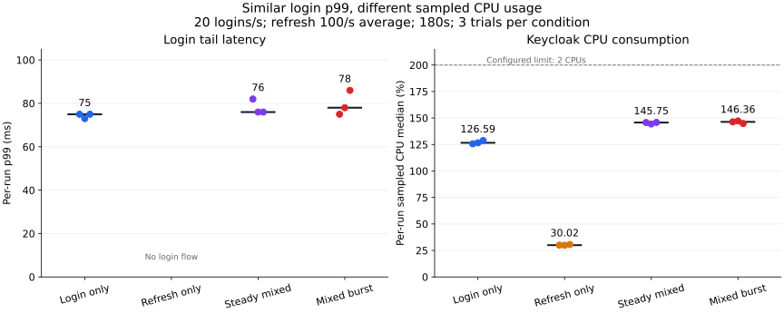
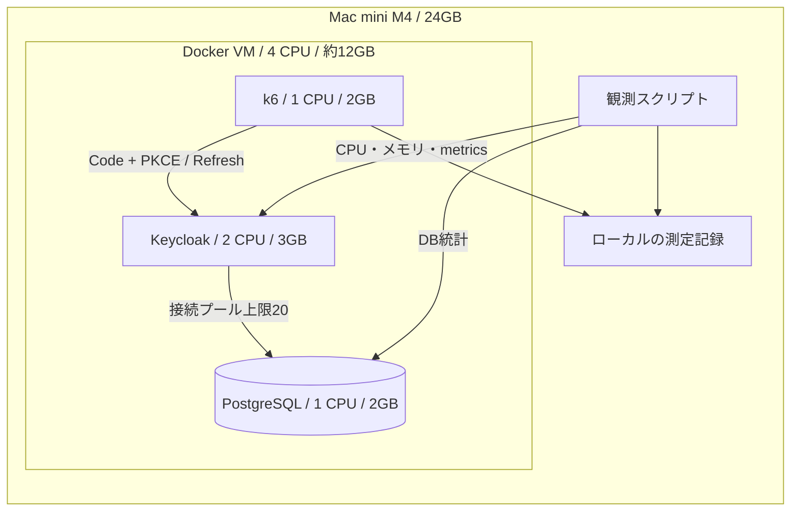
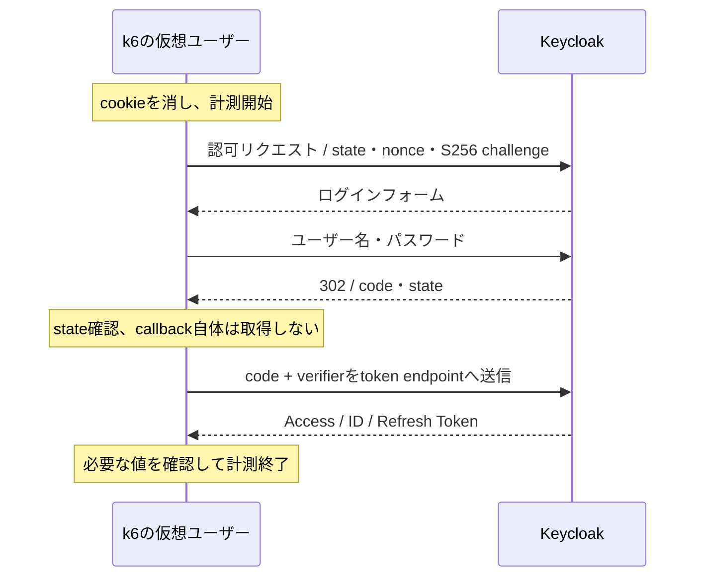
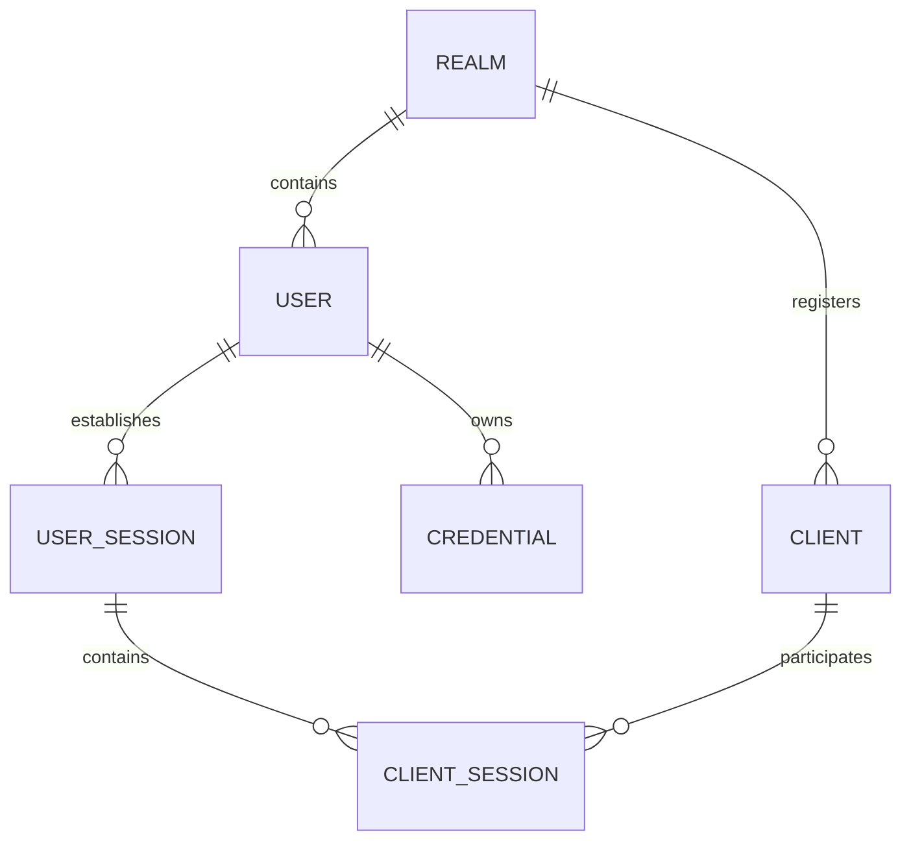
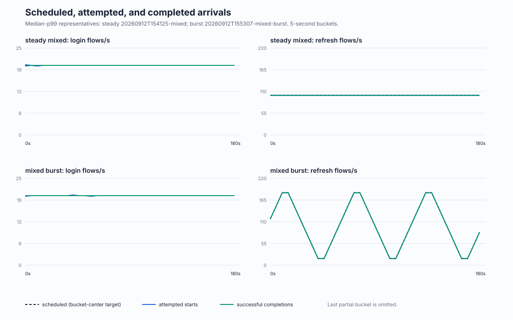
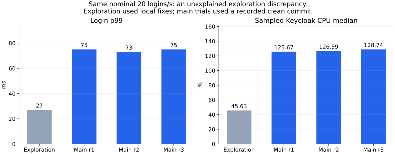

# ログイン数だけで認証基盤を見積もれる？Mac miniでKeycloakの混在負荷を測った

Keycloakに毎秒20回のログインを流す。そこへ、毎秒100回のトークン更新を追加する。

Mac miniで各条件を3回測ると、ログインp99の中央値は **75msから76ms** でした。一方、KeycloakのCPU使用率は、観測中央値を3試行でまとめると **126.59%から145.75%** になりました。

どちらも全件成功し、負荷生成器の取りこぼしは0です。遅延だけを見ると似た結果でも、資源の使い方には差がありました。



CPUの100%は、この図では1コア相当です。Keycloakには2 CPUを割り当てています。図のCPU値は約7秒ごとの観測値から求めた各試行の中央値で、期間全体のCPU時間を積算した値ではありません。

この記事では、**「ログイン数だけで認証基盤を見積もってよいのか」** を、ログイン、Refresh Tokenによる更新、両者の混在から検討します。対象はOIDCの基礎を知り、消費者向けサービスのバックエンドや認証基盤の負荷試験を担当する方です。

容量限界までは測っていません。また、探索と本比較で同じ入力率なのに大きく異なる値が出たため、その結果も後半に載せます。今回の結果は、特定の条件における観測として読んでください。

## なぜログインと更新を分けるのか

「ピーク時に毎秒何人がログインするか」は、認証基盤の負荷を考えるための入力の一つです。すでにログインしているクライアントも、Refresh Tokenを使ってアクセストークンを更新します。

OIDCはOAuth 2.0の上に認証の仕組みを定義しています。本稿の「更新」はOAuthのRefresh Token処理を指し、ログインとあわせてOIDC利用基盤の負荷として扱います。仕様上の手順は [OpenID Connect Core](https://openid.net/specs/openid-connect-core-1_0.html#CodeFlowAuth) と [OAuth 2.0 Section 6](https://www.rfc-editor.org/rfc/rfc6749.html#section-6) を参照してください。

たとえば「常時更新するセッションが30,000件あり、各セッションが300秒に1回更新する」と仮定すると、平均更新率は次の計算になります。

```text
30,000 sessions / 300 seconds = 100 refresh requests/s
```

これは負荷モデルの計算例です。今回30,000セッションを作ったわけではなく、クライアントが非アクティブな間も必ず更新するという意味でもありません。更新タイミングが偏れば、同じ平均100回/秒でも到着の形は変わります。

Keycloakの[公式ベンチマーク](https://www.keycloak.org/2025/10/keycloak-benchmark)も、ログインとトークン更新を別々の負荷として扱っています。今回の試みは新しいサイジング則の発見ではなく、その観点を小さな環境で再現し、測り方まで公開することです。

## Mac mini上に作った構成

2026年9月12日に、Apple M4 / メモリ24GBのMac miniで実行しました。Docker VMに4 CPUと約12GBを割り当て、その中でKeycloak、PostgreSQL、k6を動かしています。



| 項目 | 測定条件 |
|---|---|
| ホスト | Apple M4、10 CPU cores、24GB、macOS 26.6.2 |
| Docker | Desktop 4.63.0、Engine 29.2.1、Compose v5.0.2 |
| イメージ | Keycloak 26.7.3、PostgreSQL 17.6、k6 1.8.1。実験記録ではすべてarm64 |
| Keycloak | heap 1〜2GB、DB接続プール最大20 |
| データ | 架空ユーザー1,000人、1 realm、1 public client |
| パスワードハッシュ | 記録された実効値はArgon2id、iterations 5、memory 7168、parallelism 1、hashLength 32 |
| 更新 | Refresh Token rotation有効、再利用0 |
| 通信 | Docker内部HTTP。TLS、外部IdP、MFAは含めない |

これはローカル実験構成です。冗長化、ネットワークをまたぐDB接続、ブラウザ描画、人の入力時間、メール送信などは測っていません。負荷生成器も同じVMにいるため、k6自身の資源を一緒に観測します。

## 何を「ログイン1回」として測ったか

今回のログインは、パスワード入力を伴う **Authorization Code Flow + PKCE S256** です。トークンエンドポイントへpassword grantを送るだけの試験にはしていません。



このフローは通常3 HTTPリクエストです。したがって **20 login flows/sは20 HTTP requests/sではありません**。更新は1回のHTTPリクエストです。以下ではログインをflows/s、更新をrequests/sと区別します。

更新用セッションも、このCode + PKCEで事前に作成します。各VUは自分専用のRefresh Tokenを保持し、更新で返された次のトークンへ差し替えます。異なるVUで同じトークンを競合利用してしまうと、サーバの処理能力とは別の理由で失敗するためです。

負荷を考えるためのデータの関係は次のようになります。



これは概念ER図です。Keycloak内部の物理テーブルや永続化方式を表したものではありません。ログインでは資格情報やセッションの処理を伴い、更新では既存セッションに対する処理が発生する、という区別のために載せています。

## 入力率を固定し、成功・遅延・資源を分けて見る

各シナリオに100VUを事前割当し、一定到着率または変動到着率で処理を開始します。k6の[open model](https://grafana.com/docs/k6/latest/using-k6/scenarios/concepts/open-vs-closed/)を使い、応答が遅くなった結果、次の要求まで自然に間が空く方式を避けています。

それでも、処理枠が不足すれば予定した要求を開始できません。そのため、遅延だけでなく `dropped_iterations` と予定・実行・成功件数を確認します。

| 観点 | 実験で確認するもの |
|---|---|
| 機能 | 実KeycloakでCode + PKCEと更新が成功すること |
| 負荷成立 | 予定件数、実際の開始数、成功数、dropped |
| 成功率 | 各フロー99%以上という実験用の基準 |
| 遅延 | login p99 < 2,000ms、refresh p99 < 500msという実験用の基準 |
| 資源 | KC・DB・k6のCPU/メモリ、DB待ち、接続プール待ち、GC |
| 再現性 | コード版、環境条件、試行順、失敗を含む台帳 |

この閾値は本番SLOや業界標準ではありません。今回の比較を始めるための暫定基準です。

各runではDBを初期化し、200セッションを事前作成してから、60秒ウォームアップ、180秒測定、最大35秒の完了待ちを行います。ログイン単独でも同じ200セッションを事前作成します。

ただし、ログイン成功ごとにセッションが増えるので、**ウォームアップ後のセッション数まで全条件で等しいわけではありません**。ログアウトの負荷を追加せず、ログイン集中とそれに伴う状態増加を測っています。固定セッション数の定常負荷や長時間運転の試験とは区別します。

## 本比較は4条件、各3回

ログイン1→5→10→20 flows/s、更新5→20→50→100 requests/sと単独で探索し、試した範囲で基準を満たした20/100を本比較の入力に選びました。それ以上は探索していないため、20/100は容量限界を表しません。

| 条件 | ログイン到着率 | 更新の平均到着率 | 更新のピーク到着率 |
|---|---:|---:|---:|
| ログイン単独 | 20 flows/s | 0 | 0 |
| 更新単独 | 0 | 100 requests/s | 100 requests/s |
| 一定混在 | 20 flows/s | 100 requests/s | 100 requests/s |
| 変動混在 | 20 flows/s | 100 requests/s | 200 requests/s |

変動混在では更新率を15秒ずつ100→200→100→0→100と動かし、60秒周期で繰り返します。平均到着率と予定更新件数は一定混在と揃えます。これは滑らかなランプであり、全端末が一瞬に同時更新する状況を再現したものではありません。

単独2条件と一定混在は順序を変えながら各3回、その後に変動混在を3回連続で測りました。変動混在については、実行順や時間経過の影響を十分に分離できていません。

## 結果：遅延の差は小さく、CPUの観測値には差があった

括弧内は3試行の最小〜最大です。p99は各runのp99の中央値、CPUは各runの観測中央値をさらに3試行でまとめた値です。生の全リクエストを合算したp99や、CPU使用量の時間平均ではありません。

| 条件 | login p99 ms | refresh p99 ms | Keycloak CPU % |
|---|---:|---:|---:|
| ログイン単独 | **75（73〜75）** | — | **126.59（125.67〜128.74）** |
| 更新単独 | — | **5（5〜5）** | **30.02（29.87〜30.63）** |
| 一定混在 | **76（76〜82）** | **6（5〜6）** | **145.75（144.39〜145.86）** |
| 変動混在 | **78（75〜86）** | **6（6〜7）** | **146.36（144.82〜147.24）** |

本比較12試行は、すべて実行されたフローが成功し、droppedは0でした。ログインは各run 3,600〜3,601件、更新は18,000〜18,001件です。予定より1件多いrunもあるため、成功率の分母は予定件数ではなく実試行数にしています。

一定混在とログイン単独のCPU中央値の差は、次の計算になります。

```text
145.75 - 126.59 = 19.16ポイント
19.16 / 126.59 ≒ 15.1%（相対差）
```

「CPUが19.16%増えた」とは書かず、ポイント差と相対差を区別します。また、この差から更新1回あたりのCPUコストを逆算したり、飽和する到着率を線形に推定したりはしません。

今回の実装は `Date.now()` でフロー時間を測るため、値の分解能はミリ秒単位です。75msと76msの1ms差に統計的な意味がある、とも主張できません。

ここで実務に持ち帰りたいのは、**ログインの成功率やp99だけでは、更新を追加したときの資源の違いを把握できない**ということです。単独と混在で資源の観測値も比較する理由が、このデータにあります。

### 更新を変動させるとどうなったか

変動混在のlogin p99中央値は78ms、更新p99は6msでした。今回の水準では暫定基準の違反はありませんでした。



この時系列は、各条件のlogin p99で中央に位置するrunを選んでいます。最速のrunを選んだものではありません。予定曲線は5秒バケット中央の値で、試行開始と成功完了は別の時点に記録されます。

ただし、「集中させても問題ない」と一般化はできません。今回の変動は15秒のランプであり、さらに資源観測は約7秒周期です。短い瞬間的なスパイクは十分に評価していません。

### 負荷生成器が上限だったのか

公開集約値では、本比較のk6の観測CPU最大値は7.30%、メモリ最大値は約175MiBで、droppedは0でした。この範囲では生成器が上限だったことを示す兆候はありません。

Keycloakの観測CPU最大値は181.16%で、設定上限は2 CPUです。ただし、約7秒間隔の観測点の最大値であり、その間にも一度も上限へ達していないとは言えません。

DBロック待ちと接続プール待ちは観測点で0でした。短い待ちが一切なかった、という意味ではありません。同じホスト上のCPU配置やVMの影響も残ります。

また、公開集約JSONにはrefresh-r1とmixed-r1で各1件の監視収集エラーがあります。認証フローは成功していても、監視まで完全だったわけではありません。どの観測項目が欠けたかは公開集約値だけでは特定できず、CPUなどの集計にはこの制約が残ります。

## 都合の悪い探索結果も残す

探索でログイン20 flows/sを流したときは、p99が27ms、Keycloak CPU中央値が45.63%でした。本比較の同じ入力率では、p99が73〜75ms、CPUが125.67〜128.74%です。



この違いの原因は確定していません。探索は未コミットの修正を含む時点、本比較は記録された同一のcleanなコミットで実施したという違いもあります。修正内容は集計と実行情報の記録ですが、公開集約値だけで実行条件の差を完全に排除することはできません。

本記事の比較表には、本比較として記録した3試行すべてを使っています。探索値を最良性能として採用せず、かといって削除もしません。この不一致が残るため、**今回のCPU差を普遍的な係数や厳密な因果効果として扱うことは避けます**。

全23試行の台帳には、初回のDocker仮想ディスク不足による起動失敗、smoke、観測受入、単独探索、本比較を残しています。起動失敗は性能結果には数えていません。[実験台帳](https://github.com/higuuu/oidc-load-lab/blob/10fe2ac519ff23fd4505907040a37f35be854f4f/results/experiment-ledger.md)

## 自分の環境で再実行するには

実験コード、構成、集約値を [oidc-load-lab](https://github.com/higuuu/oidc-load-lab) に置いています。以下は結果PRのコード版を取得する例です。Docker Desktop、Python 3.10以上、Node.js 22以上を用意してください。

```sh
git clone https://github.com/higuuu/oidc-load-lab.git
cd oidc-load-lab
git checkout 10fe2ac519ff23fd4505907040a37f35be854f4f
python3 scripts/lab.py init
python3 scripts/lab.py check
python3 scripts/lab.py run smoke
```

smokeが成功したら、低い率から始めます。下記は本比較の条件であり、すべての環境で通ることを保証する値ではありません。

```sh
python3 scripts/lab.py run login --login-rate 20 --seconds 180 --vus 100
python3 scripts/lab.py run refresh --refresh-rate 100 --seconds 180 --vus 100
python3 scripts/lab.py run mixed --login-rate 20 --refresh-rate 100 --seconds 180 --vus 100
python3 scripts/lab.py run mixed-burst --login-rate 20 --refresh-rate 100 --seconds 180 --vus 100
```

`run` は毎回、この実験のComposeプロジェクト専用DBを削除・初期化します。実データを入れず、同じproject名で複数実験を並行実行しないでください。コマンドが終わったら、各runの出力を `scripts/report.py` で集計します。

測定では次の3点にも注意しました。

- **setupとwarmupを混ぜない。** 全体のHTTP件数ではなく、`phase=measure` のフロー別メトリクスを使う。
- **更新失敗を再ログインで隠さない。** この生成器ではRT更新失敗後にそのVUを失敗扱いで維持するため、以降の試行数はHTTP送信数と一致しなくなる。最初の失敗を調べる。
- **観測の時計を揃える。** 監視開始はsetup前なので、監視の経過0秒を測定開始0秒として重ねない。

公開しているのは集約JSON、図、台帳、コードです。トークンや資格情報を含み得る生ログは公開していません。そのため、第三者が確認できるのは公開された試行値の再集約と、同条件の再実験までです。今回の記事化でも、生リクエストからのp99再計算やmanifestの再検証までは行っていません。

なお、生成器はstate/nonce/issuer/audience/expiryを確認していますが、ID Tokenの署名を検証していません。これは負荷生成キットであり、そのまま本番RPの実装例として使うものではありません。

## 本番の設計に持ち帰るもの

この実験だけで本番の必要台数は決められません。代わりに、見積もりと負荷試験の入力を次のように整理できます。

| 集める入力 | 試験で確かめること |
|---|---|
| 新規ログイン到着率と認証方式 | パスワード、外部IdP、MFAなど、実フローのコスト |
| 更新を行うアクティブセッション数と実際の更新間隔 | ログイン済みクライアントによる継続負荷 |
| 更新・再接続の時間的な偏り | 平均値が等しくてもピークで違いが出るか |
| 許容する成功率・p99 | 単独と混在の両方で目標を満たせるか |
| 資源上限、DB、配置、障害時の残存能力 | 通常時の遅延だけでは見えない制約 |

今回は単一Mac、単一Keycloak、内部HTTP、180秒×3試行、架空1,000ユーザーという条件です。HA、TLS、MFA、外部IdP、長時間のDBやGC、障害時の動作、実利用者数への換算は未検証です。

次は、まず同じ20 login flows/sで探索と本比較の差が再現するかを、実効設定・コード・ウォームアップを揃えて確認したいと考えています。その後、ログイン率を固定して更新率を段階的に上げ、どの指標から悪化するかを追うと、今回の観測を容量設計へ近づけられます。

今回の20/100という条件では、更新を加えてもログインは成功し、p99の変化は小さいままでした。一方、CPUの観測値には差がありました。**ログインの速さと、認証基盤の資源の使い方を、同じ比較の中で測る。** 小さな実験から持ち帰る設計上の観点はそこです。
