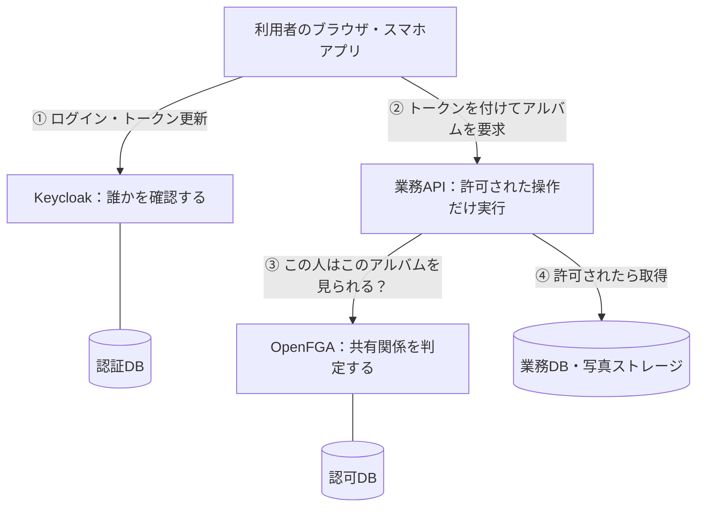
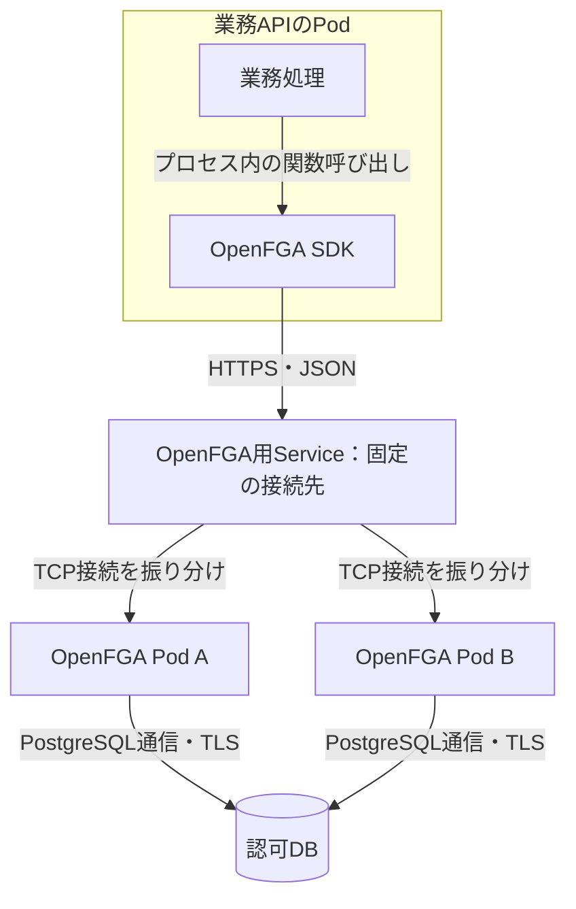
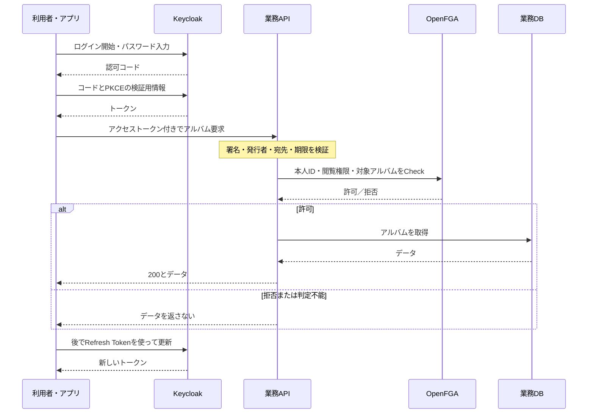
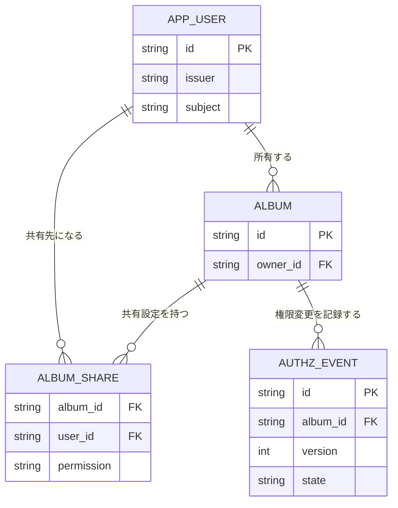
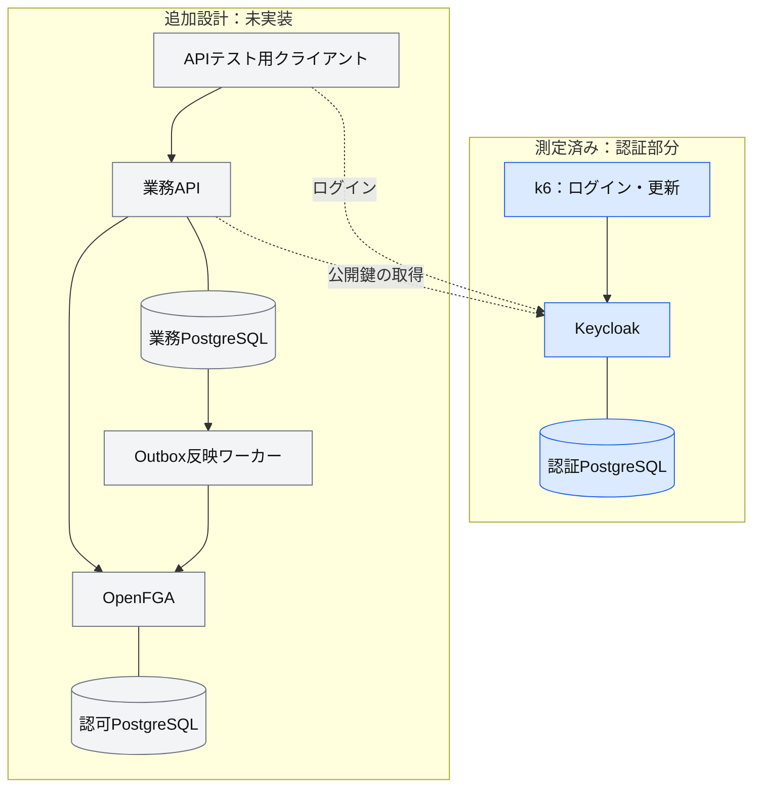
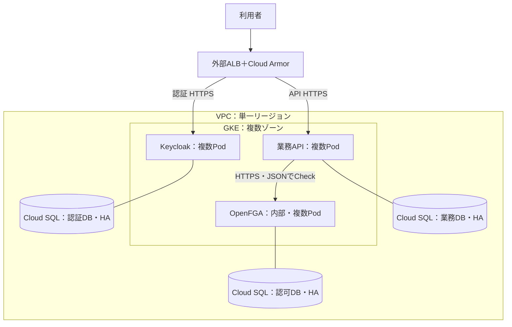
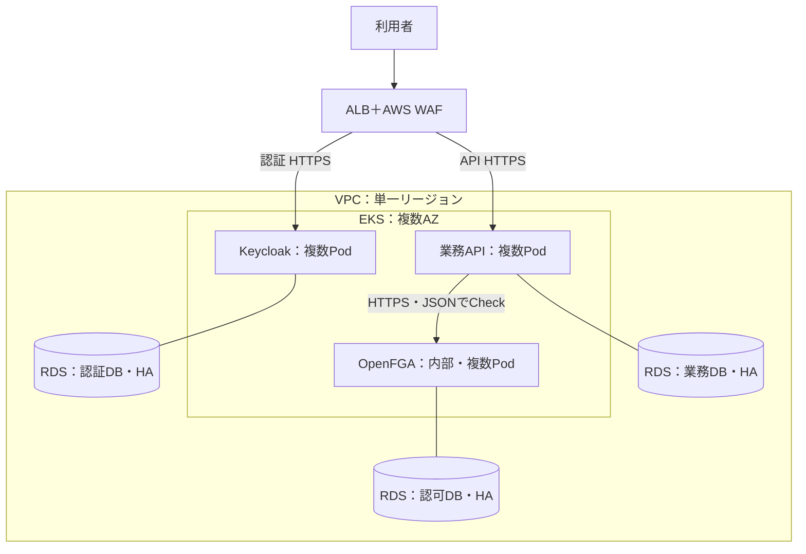
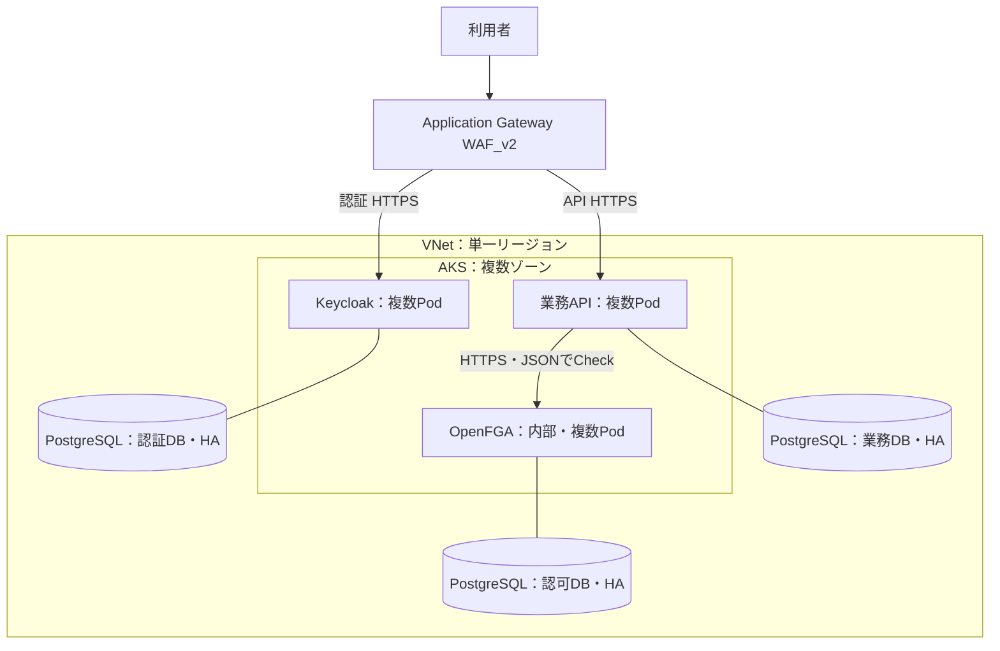
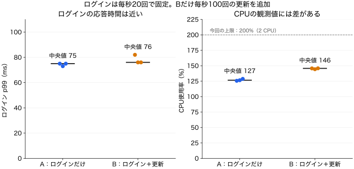

# KeycloakとOpenFGAで考えるOSS認証・認可基盤 — ローカル・GCP・AWS・Azureの構成と負荷試験

一般消費者向けの写真共有サービスを作るとします。利用者はログインし、自分のアルバムを作り、家族や友人に共有できます。

必要なのはログイン画面だけではありません。「この人は誰か」を確認し、「このアルバムを見せてよいか」を判断し、共有を解除したらアクセスを止める必要があります。利用者が増えたときや、サーバが故障したときにも、この判断を保たなければなりません。

この記事では、**Keycloakで認証し、OpenFGAで共有関係を判定し、業務APIでアクセスを制御する構成**を設計します。ローカル・GCP・AWS・Azureへの配置と、負荷試験で確認する箇所までをつなげます。

対象は、OIDCのログインを実装した経験はあるものの、認可や運用を含む全体構成に悩んでいるバックエンドエンジニア・テックリードです。

**設計と実測の範囲は次のとおりです。** 全体を構築済みとする記事ではありません。

| 対象 | この記事で提供するもの | 現在の状態 |
|---|---|---|
| Keycloak＋PostgreSQL＋k6 | ローカル実行キット、認証負荷の集約結果 | Mac miniで測定済み |
| 業務API＋OpenFGA | 処理の流れ、認可モデル案、データ設計 | 未実装・未測定 |
| GCP・AWS・Azure | 共通設計を各クラウドへ配置する構成案 | 未デプロイ・未測定 |

## 1. まず全体像：認証・認可・業務処理を分ける

**Keycloakは、ログインを受け付け、本人を確認してトークンを発行するOSSの認証サーバです。** **OpenFGAは、「誰が、どの対象に、何をできるか」を関係データから判定するOSSです。** 業務APIはその判定を使い、実際にデータを返すか、操作を拒否するかを決めます。[Keycloak](https://www.keycloak.org/)、[OpenFGAの概念](https://openfga.dev/docs/concepts)

### Keycloak・OpenFGA・SDKは、それぞれ何なのか

KeycloakとOpenFGAは、**業務APIに組み込むライブラリではなく、それぞれ別プロセスで起動するサーバ**です。このクラウド案では別のPodとして動かします。PodはKubernetesがコンテナを配置・管理する単位です。

| 部品 | 担当すること | 今回の使い方・選ぶ理由 |
|---|---|---|
| Keycloak | ユーザー管理、ログイン、SSO、OIDCなどの認証機能 | パスワード認証やトークン発行を自作せず、標準プロトコルでアプリと接続する |
| OpenFGA | 利用者と対象の関係を保存し、権限を判定する | アルバムごとの共有ルールを、複数の業務APIで共通化する |
| OpenFGAクライアントSDK | APIからOpenFGAへの要求・応答を扱うライブラリ | 業務APIのプロセス内に入れる。認可の判定エンジンやDBを内包するものではない |
| 業務API | アルバムの取得・編集・共有など | トークンを検証し、認可結果に従って処理を許可・拒否する |

Keycloakにもロールや認可機能があります。本案でOpenFGAを別に置くのは、Keycloakに認可機能がないからではなく、対象ごとの共有関係を独立したモデルとサービスで管理するためです。ログイン画面、本人確認、パスワードの保存はOpenFGAに任せません。[Keycloakの機能](https://www.keycloak.org/)、[OpenFGAの構成](https://openfga.dev/docs/concepts)

次の図の①と②は、別の通信です。ログインのたびに写真を取得するわけでも、写真を取得するたびにパスワードを送るわけでもありません。



例えば、Aさんが正常にログインしても、Bさんの非公開アルバムを見てよいとは限りません。Keycloakの認証に成功したことと、OpenFGAの閲覧判定に成功したことを、APIで別々に確かめます。

ただし、どのサービスにもOpenFGAが必要なわけではありません。

| 必要な権限 | 最初に考える実装 |
|---|---|
| 一般ユーザーと運営者を区別したい | KeycloakのロールとAPI側の検証 |
| 自分が作ったデータだけ操作したい | APIで所有者IDを照合 |
| 対象ごとに所有者・編集者・閲覧者が異なり、複数APIで共有したい | OpenFGAなどへ関係と判定を集約 |

今回OpenFGAを置く理由は、**アルバムごとの共有を複数のAPIで同じルールにしたいから**です。サービスとDBが増える運用コストを、この必要性と引き換えに受け入れる設計です。

### まず小さく始め、必要になった部品を分離する

この共有機能だけなら、業務APIが業務DBの所有者・共有先を調べる構成でも実装できます。OpenFGAを使えば常に速くなる、という選定ではありません。

| 段階 | 構成 | 分離するきっかけ |
|---|---|---|
| 最小構成 | Keycloak＋業務API。認可は業務DBで判定 | API内でルールを管理できる間はこれで始める |
| 判定の共通化 | OpenFGAを別プロセスで追加 | 複数APIで同じ権限モデルを使いたい |
| 資源・障害の分離 | 用途別DBインスタンスと冗長構成 | 干渉、障害範囲、独立した増強・保守が問題になる |

OpenFGAは本番では専用DBを推奨していますが、**専用の論理DBと専用のDBインスタンスは区別します。** 節約案では1台のPostgreSQLに認証・認可・業務の論理DBと接続ユーザーを分けて置けます。その場合、CPU・接続数・障害・メンテナンスは共有します。後半の3クラウド図は、分離を進めた段階の案です。[OpenFGAのDB推奨](https://openfga.dev/docs/best-practices/running-in-production)

## 2. 構成を決める前に、何を守るかを決める

「登録者100万人」だけでは必要な台数は決まりません。ログイン、更新、アルバム閲覧では、負荷がかかる場所が異なります。

| 要件 | 今回の設計方針・決める値 | 確認方法 |
|---|---|---|
| 他人の非公開データを返さない | 全保護APIで本人確認と対象ごとの認可。判定不能なら返さない | 他人のIDへの差し替え、未ログイン、認可障害のテスト |
| 共有解除を反映する | 解除完了の応答後に始まる閲覧を拒否する設計。進行中の要求は別途定義 | 解除直後に複数APIインスタンスから閲覧 |
| 混雑しても使える | ピーク時のログイン/秒、更新/秒、API/秒と各p95・p99、成功率の目標を決める | 混合負荷と段階的な増加 |
| 1ゾーンが止まっても継続する | クラウド案は単一リージョン・複数ゾーン。縮退時に必要な容量を残す | Pod・ノード・ゾーン相当の停止、DB切り替え |
| データを戻せる | 許容停止時間RTO、許容データ損失RPOを決め、3種類のDBを復旧する | バックアップから復元し、共有状態も照合 |
| 攻撃・誤操作を追える | ログイン失敗、権限変更、認可エラーを記録。トークンは記録しない | 監査ログとアラートの確認 |
| 運用を継続できる | 更新担当、脆弱性対応、鍵・秘密情報の交換、費用上限を決める | 更新・ロールバック・当番の演習 |

この記事の設計例では、仮の受入目標をログインp99 2秒以内、更新p99 500ms以内、閲覧API p99 300ms以内、月間可用性99.9%と置きます。復旧目標はRTO 60分・RPO 5分です。これらは測定結果から算出した値でも、達成済みの値でもありません。事業上の許容範囲と費用に合わせて調整し、その目標を守れる負荷を後で測ります。後半のMac miniの結果を、そのまま必要台数にはしません。登録・メール確認・パスワード再設定・MFA・外部IdP連携も本番の要件ですが、今回の測定には含みません。

## 3. 1回のアクセスを追うと、実装する場所がわかる

### 矢印の正体：どのプロトコルで呼び出すのか

本案では、アプリとサーバ、サーバ同士のAPI呼び出しに**HTTPS**を使います。HTTPSはTLSで保護したHTTP通信です。OIDCやOAuthはその上でやり取りする認証・認可の手順で、Kubernetes専用の通信方式ではありません。

| 呼び出し元 → 先 | 本案の通信方式 | 送るもの・返るもの |
|---|---|---|
| 利用者のアプリ → Keycloak | HTTPS上のOIDC/OAuth | 認可リクエスト、認可コード交換、トークン更新 |
| 利用者のアプリ → 業務API | HTTPS | アクセストークンと業務要求、業務データ |
| 業務API → Keycloak | HTTPSでJWKS取得 | 検証用の公開鍵。通常の業務要求ごとには取得しない |
| 業務APIのSDK → OpenFGA | **HTTPS＋JSONのHTTP API** | 利用者・権限・対象を指定したCheck、許可／拒否 |
| Outboxワーカー → OpenFGA | HTTPS＋JSONのHTTP API | 共有関係の追加・削除 |
| Keycloak / OpenFGA / 業務API → 各DB | PostgreSQLの通信プロトコル＋TLS | DBドライバからの読み書き。HTTPではない |

OpenFGAはHTTP APIとgRPCを提供しますが、**この記事ではHTTP APIを選びます。** JSONで要求を確認しやすく、HTTPクライアントやSDK、既存のTLS・監視設定を使えることを優先します。gRPCを採用する場合は、クライアント・HTTP/2の経路・接続分散まで合わせて設計します。「SDKを入れたら自動的にgRPCになる」という意味ではありません。[OpenFGAのAPI例](https://openfga.dev/docs/getting-started/perform-check)、[HTTP/gRPCのTLS設定](https://openfga.dev/docs/best-practices/running-in-production)

Kubernetes上の認可呼び出しだけを拡大すると、次の構成です。



SDKに指定する接続先の例は `https://openfga.authz.svc.cluster.local` です。`openfga`はService名、`authz`はnamespace名で、クラスタのDNSドメインが`cluster.local`の場合の例です。PodのIPを直接埋め込みません。Serviceは別の認可アプリではなく、変わるPod群へ接続するためのKubernetesの仕組みです。[ServiceとDNS](https://kubernetes.io/docs/concepts/services-networking/dns-pod-service/)

この例ではServiceの443番ポートをOpenFGAのTLS待受へ転送し、接続先名に合う証明書と、API側で信頼するCAを設定します。Serviceを作るだけでHTTPSになるわけではありません。SDKにはサーバ間認証用の資格情報も設定し、利用者のアクセストークンとは別に管理します。認可対象の本人IDは、業務APIが検証した利用者トークンから決めます。

APIはCheckの結果を待つため、通信・判定・DB待ちが閲覧の遅延に加わります。接続を再利用し、業務API全体の制限時間より短いタイムアウトを置き、失敗時に無制限に再試行しません。通常のServiceは接続単位で振り分けるため、接続を長く保持すれば要求数が各Podへ均等になるとは限りません。

**同じクラスタ内でも、別ノード・別ゾーンならネットワークを通ります。** Pod間通信だから速いとは判断せず、APIから見たCheckの応答時間、OpenFGAの処理時間、DB待ちを測って切り分けます。認可部分はまだ未測定です。

### ログインと更新はKeycloakへ

アプリはAuthorization Code Flow＋PKCEを使ってログインします。PKCEは認可コードの横取り対策に使う仕組みです。アクセストークンをAPIへ提示し、有効期限に合わせてRefresh Tokenで更新します。[OIDC Core](https://openid.net/specs/openid-connect-core-1_0.html#CodeFlowAuth)、[PKCE仕様](https://www.rfc-editor.org/rfc/rfc7636)



これは設計案の通信図です。ブラウザでは、サーバ側でトークンを保持するBFFを使う構成も選べます。その場合はAPI/BFFとブラウザの間のCookie・CSRF対策まで設計します。モバイルではOSの安全な保存先を使い、Refresh Tokenを複数処理で無秩序に更新しないようにします。

### APIは、トークンを読んだだけで信用しない

API用のJWTアクセストークンを発行する設定とし、APIで署名・`iss`・`aud`・期限・許可する署名アルゴリズムを検証します。ID TokenをAPIの入場券にはしません。公開鍵はJWKSから取得して保持し、鍵交換時の再取得も設計します。[JWTの検証指針](https://www.rfc-editor.org/rfc/rfc8725)

本人IDは検証済みのトークンから決めます。リクエスト本文のユーザーIDでOpenFGAへ問い合わせると、利用者が他人になりすませます。複数issuerを扱うなら、`sub`だけで同一人物と見なさず、issuerとの組を業務側の利用者IDへ対応づけます。

JWTをローカル検証する構成では、通常のAPIアクセスごとにKeycloakへ問い合わせません。その代わり、**ログアウトやアカウント停止だけで発行済みJWTが即座に無効になるわけではありません。** 有効期間、オンラインの状態確認、サービス側の停止判定のどれで要求を満たすかを決めます。

### 「判定する」のはOpenFGA、「止める」のはAPI

OpenFGAへ渡すのは、例えば次の三つです。

```text
誰が：user:alice
何を：can_view
どれに：album:summer
```

許可なら処理を続け、拒否なら403相当、タイムアウトなどで判定できないなら503相当としてデータを返しません。エラーを許可扱いにする実装は避けます。リソースの存在を隠したい場合は、拒否時の応答もサービス全体で統一します。

共有の追加・削除自体も、所有者など許可された人だけが実行できるようAPIで認可します。OpenFGAのWriteを利用者へ直接開放しません。一覧APIも全件取得してそのまま返さず、閲覧可能な対象へ絞る設計とし、検索・ページングを含めてテストします。

## 4. 認可モデルとデータの持ち方

今回の最小モデル案は「所有者は閲覧・編集できる」「閲覧者は閲覧だけできる」です。OpenFGAのDSLで表すと次のようになります。これは説明用のモデル案で、まだ実行検証していません。

```text
model
  schema 1.1

type user

type album
  relations
    define owner: [user]
    define viewer: [user]
    define can_view: owner or viewer
    define can_edit: owner
```

`user:alice / owner / album:summer` を登録すればAliceは閲覧・編集できます。`user:bob / viewer / album:summer` だけならBobは閲覧だけです。本番ではモデルIDを固定して呼び出し、変更をテストしてから切り替えます。[モデルの固定](https://openfga.dev/docs/getting-started/immutable-models)、[モデルのテスト](https://openfga.dev/docs/modeling/testing)

データは三つの責任に分けます。

| 保存先 | 保存するもの | アプリからの扱い |
|---|---|---|
| KeycloakのDB | 本人確認情報、認証セッションなど | Keycloak経由で操作し、内部テーブルを直接更新しない |
| 業務DB | 利用者との対応、アルバム、共有変更の履歴 | 業務APIが更新する |
| OpenFGAのDB | 認可モデルと利用者・対象の関係 | OpenFGA API経由で操作する |



これは**業務側の概念ER図**です。OpenFGAの物理テーブル図ではありません。利用者の`issuer + subject`には一意性を持たせます。Keycloakの内部IDをDB間の外部キーにせず、API経由の対応として扱います。

### DBを分けた後の、共有解除をどう扱うか

業務DBとOpenFGAへの二重書き込みは、片方だけ成功する可能性があります。本案では共有設定を業務DBの正本とし、同じトランザクションで変更イベントを保存するOutbox方式を採ります。ワーカーが順序と冪等性を管理してOpenFGAへ反映し、差分を定期照合します。

ただし、**非同期反映だけでは「共有解除の完了直後から拒否」を満たせません。** 本案では対象アルバムを権限変更中にし、APIはその状態を正本DBで確認して保護対象操作を一時拒否します。OpenFGAへの削除・確認が成功してから変更中を解除し、解除完了を返します。失敗中は保留として再試行します。API側の可用性とDB負荷に影響するため、解除遅延を許容する設計と比較して選ぶ必要があります。

OpenFGAのキャッシュを有効にする場合、変更直後の古い許可にも注意します。この最小案では認可結果をアプリ側でキャッシュせず、Checkは`HIGHER_CONSISTENCY`を使う前提です。これはOpenFGAのキャッシュを迂回する指定で、DB間の書き込みを原子的にする機能ではありません。対象アルバムごとに変更を直列化し、バージョンが一致したイベントだけが変更中状態を解除できるようにします。[整合性の指定](https://openfga.dev/docs/interacting/consistency)

## 5. ローカル：動く範囲を小さく作り、順に確かめる

次の図は、Mac mini上の構成を認可まで拡張する案です。**青が既存の測定済み範囲、灰色が追加する未実装の範囲**です。色だけでなく箱にも状態を書いています。



既存のキットはKeycloak 26.7.3、PostgreSQL 17.6、k6 1.8.1です。Docker VMに4 CPU・約12GBを割り当て、Keycloakは2 CPU・3GB、DBとk6は各1 CPU・2GBを上限にしました。

この設定のまま認可側まで同時に負荷をかけられるとは限りません。24GBのMacでは、まず認可の機能テストを低負荷で行い、認証単独・認可単独・混合の順で、VMのメモリとCPUの余裕を確認します。OpenFGAは実装時にバージョンを固定します。

ローカルでは用途別のDB・ユーザーを分けて同じPostgreSQLインスタンスを共有する節約案もあります。ただし本番案では独立したDBサービスに分け、認証の書き込みが認可・業務に与える干渉を減らします。OpenFGAも本番では専用DBを推奨しています。[本番構成の指針](https://openfga.dev/docs/best-practices/running-in-production)

既存キットは内部issuer `http://keycloak:8080/realms/oidc-lab` をk6から使います。ブラウザ用の完成済みデモではありません。画面を追加するときは、ブラウザとAPIの双方から到達できる同じissuer・名前解決・TLS・redirect URIを設定します。

## 6. 本番へ移すときに共通して変えること

ここでは、**単一リージョン・複数ゾーンのKubernetesと、マネージドPostgreSQL**へ配置する案を示します。GCP・AWS・Azureで同じ責任分担を保つための選択で、Kubernetes自体が必須という意味ではありません。運用経験がなければ、VM構成やマネージド認証との費用・運用比較も必要です。

### なぜKubernetesを選ぶのか。選ばなくても通信できるのか

**KeycloakとOpenFGAをHTTPで呼ぶために、Kubernetesは必要ありません。** Docker Composeならサービス名、VMなら内部DNSやロードバランサを接続先にして、同じ通信を実装できます。

ここでKubernetesを選ぶ理由は、複数のサーバを増減・交換しながら運用する仕組みを共通化したいからです。

| 必要なこと | Kubernetesで使う仕組み | 自動では解決しないこと |
|---|---|---|
| Podが入れ替わっても同じ名前で接続 | Service（ClusterIP）とクラスタDNS | TLS証明書やサーバ間認証 |
| 複数のPodへ接続を振り分ける | Serviceとネットワーク実装 | リクエストごとの均等配分、処理速度の保証 |
| 落ちたプロセスの再起動・必要数の維持 | kubelet、Deployment等のコントローラ | DB障害、アプリのバグの修復 |
| 更新しながらサービスを続ける | readiness、ローリング更新、PDB | DBスキーマやKeycloakバージョン間の互換性 |
| ゾーンへ分散して配置 | topology spread、ノード配置 | 1ゾーン喪失後に必要な容量の確保 |
| 許可した経路だけ通信させる | NetworkPolicy対応のネットワーク実装 | デフォルトでの遮断、通信の暗号化 |

ClusterIPはクラスタ内から使う接続先です。それだけで、クラスタ内の他のPodからのアクセスを禁止するわけではありません。NetworkPolicyでAPI・ワーカーからの必要な通信を許可し、DNSやDB接続の経路も設定します。ポリシーを実際に強制できるネットワークプラグインが必要です。[Kubernetes Service](https://kubernetes.io/docs/concepts/services-networking/service/)、[NetworkPolicy](https://kubernetes.io/docs/concepts/services-networking/network-policies/)

その代わり、Kubernetesにはクラスタ・ノード・ネットワーク・アップグレードを管理する負担があります。小規模なサービスなら、まずVMやComposeで機能を確認し、複数サービスの冗長運用が必要になった時点で採用を判断します。GKE・EKS・AKSは制御プレーンの管理を委ねるための選択で、認証・認可の運用全体をクラウドに任せる選択ではありません。

PostgreSQLを選ぶ理由は、既存の認証実験で使っており、認可・業務側も同じDB製品でバックアップや監視の知識を共通化できるためです。クラウドではHAや復元の運用をマネージドサービスへ寄せます。DB製品を揃えることと、DBインスタンスを共有することは別の判断です。

三つの図は同じ読み方です。入口からKeycloakと業務APIに振り分け、業務APIだけが内部のOpenFGAへ問い合わせます。用途別DBはそれぞれ独立したHA構成です。ワーカー・秘密情報・監視は見通しを保つため図では省略し、後の表にまとめます。

### GCP：GKEとCloud SQLへ配置する



GKEのregional構成に加え、ワーカーノードとPodもゾーンへ分散させます。Cloud SQLはHAを明示的に有効にし、Private IPで接続する案です。GKEの制御プレーンが冗長でも、Keycloakが1 Podだけならアプリの冗長化にはなりません。入口はGKE IngressとBackendConfigで構成し、Cloud ArmorのポリシーとバックエンドHTTPSを明示します。[GKE Ingress](https://docs.cloud.google.com/kubernetes-engine/docs/how-to/ingress-configuration)、[GKE regional](https://docs.cloud.google.com/kubernetes-engine/docs/concepts/regional-clusters)、[Cloud SQL HA](https://docs.cloud.google.com/sql/docs/postgres/configure-ha)

### AWS：EKSとRDSへ配置する



AWS Load Balancer ControllerでALBと接続し、EKSのノード・Podは複数AZへ分散させる案です。RDSはpublic accessを無効にし、Security Groupで必要な通信だけ許可します。[ALBとの接続](https://docs.aws.amazon.com/eks/latest/userguide/alb-ingress.html)、[EKSのAZ配置](https://docs.aws.amazon.com/eks/latest/best-practices/subnets.html)

ここでいうRDS Multi-AZは、単一standbyを持つDB instance構成です。standbyは可用性のためのもので、読み取り負荷を分散する先ではありません。[RDS Multi-AZ](https://docs.aws.amazon.com/AmazonRDS/latest/UserGuide/Concepts.MultiAZSingleStandby.html)

### Azure：AKSとAzure Database for PostgreSQLへ配置する



Application Gateway Ingress Controllerで入口をAKSへ接続する案です。Application GatewayとAKSをゾーン障害に備えた配置にし、PostgreSQL Flexible Serverはzone-redundant HAとprivate networkingを選びます。採用リージョン・SKUでの提供状況を確認します。[AKSとの接続](https://learn.microsoft.com/en-us/azure/application-gateway/ingress-controller-overview)、[Application Gatewayの冗長性](https://learn.microsoft.com/en-us/azure/reliability/reliability-application-gateway-v2)、[AKSの信頼性設計](https://learn.microsoft.com/en-us/azure/aks/best-practices-app-cluster-reliability)、[PostgreSQL HA](https://learn.microsoft.com/en-us/azure/postgresql/flexible-server/concepts-high-availability)

### 図に描いていない運用部品も決める

以下はこの構成案での対応表です。各サービスを作るだけで設定が連携するわけではありません。

| 役割 | GCP案 | AWS案 | Azure案 |
|---|---|---|---|
| 秘密情報 | Secret Manager | Secrets Manager | Key Vault |
| ワークロードのクラウド権限 | Workload Identity Federation for GKE | EKS Pod Identity | Microsoft Entra Workload ID |
| メトリクス・ログ | Cloud Monitoring / Logging | CloudWatch | Azure Monitor |
| 写真・監査出力の保存 | Cloud Storage | S3 | Blob Storage |
| 権限変更の反映 | GKE内のOutboxワーカー | EKS内のOutboxワーカー | AKS内のOutboxワーカー |

ワークロードから秘密情報へアクセスする連携は、[GKE](https://docs.cloud.google.com/kubernetes-engine/docs/tutorials/workload-identity-secrets)、[EKS](https://docs.aws.amazon.com/secretsmanager/latest/userguide/ascp-pod-identity-integration.html)、[AKS](https://learn.microsoft.com/en-in/azure/aks/workload-identity-deploy-cluster)の公式手順を確認します。これらのクラウド権限は、利用者のアルバム閲覧権限とは別です。

写真ストレージは公開バケットにしません。APIで認可して配信するか、有効期間を限定した署名付きURLを発行します。後者では共有を解除しても発行済みURLが期限まで使える場合があるため、「解除後に止める」という要件との整合を取ります。

### どこが止まると、何ができなくなるか

| 障害箇所 | この構成での影響 | 備えること |
|---|---|---|
| Keycloak・認証DB | 新規ログインと更新に失敗。発行済みJWTのAPI利用は鍵・期限・認可などの条件を満たせば継続し得る | トークン有効期間、鍵の保持、停止アカウントの扱いを確認 |
| OpenFGA・認可DB | 本人確認できても、保護APIの認可判定ができない | 判定のタイムアウトを定め、無制限に再試行せず一時エラーにする |
| Outboxワーカー | 共有変更が保留になる | 未反映件数・最古イベントの経過時間を監視し、再実行と照合を用意 |
| 業務DB | アルバム取得も変更中状態の確認もできない | APIを成功扱いにせず、DB復旧後に権限の整合も確認 |

この依存関係を持つので、各クラウドサービスのSLAを並べただけで、ログインから閲覧までの可用性を保証することはできません。

### KeycloakはPodを増やすだけでは完成しない

Keycloakのクラスタ構成、ノード探索、内部キャッシュ通信、ゾーンをまたぐ遅延を設定・確認します。本案は組み込みInfinispanを使う単一クラスタで、外部Redisを追加する案ではありません。公式の単一クラスタ設計も低遅延のゾーン間接続を前提にしています。3クラウドへ同時に一つのKeycloakクラスタを広げる構成にはしません。[クラスタとキャッシュ](https://www.keycloak.org/server/caching)、[単一クラスタの前提](https://www.keycloak.org/high-availability/single-cluster/building-blocks)

外部公開するホスト名を固定し、ロードバランサからの転送ヘッダは信頼する経路に限定します。本案では入口でTLS終端後、バックエンドへもHTTPSで接続します。管理画面・管理API・メトリクスは利用者向け入口から公開せず、運用経路と公開パスを分けます。[リバースプロキシ設定](https://www.keycloak.org/server/reverseproxy)

OpenFGAも内部Serviceであれば無条件に安全とは考えず、サービス間認証・TLS・NetworkPolicyを設定します。APIとワーカーが使う資格情報はブラウザへ渡しません。[OpenFGAの本番設定](https://openfga.dev/docs/best-practices/running-in-production)

各サービスを複数Podにし、topology spread・readiness・PodDisruptionBudgetを設定します。ただしPDBは自発的な停止を制御するもので、突然のゾーン障害を防ぐ機能ではありません。1ゾーン喪失後の残り容量と、DB切り替え時の接続再確立を試験します。

DB接続も、`最大Pod数 × Podごとの接続上限` に運用・移行用の余裕を足して予算化します。CPUが高いからPodを増やすだけでは、DB接続数を使い切る可能性があります。3組のHA DBとKubernetesの常時費用も含めて判断します。

## 7. この構成のうち、認証部分をMac miniで測ってみた

ここからが実測です。**業務APIやOpenFGAを通した全体性能ではなく、図のKeycloak＋認証DBの部分だけ**を測りました。負荷をかけるk6も同じMac上にあります。

ログインはフォーム取得・認証情報送信・認可コード交換までを1回、更新はRefresh Tokenによるトークン取得を1回としています。画面描画や人の入力時間を含みません。各条件は60秒のウォームアップ後に180秒測定し、3回ずつ実行しました。

| 条件 | ログイン/秒 | 更新/秒 | ログインp99 | 更新p99 | Keycloak CPU |
|---|---:|---:|---:|---:|---:|
| A：ログインだけ | 20 | 0 | 75ms | — | 約127% |
| B：両方 | 20 | 100 | 76ms | 6ms | 約146% |
| C：更新だけ | 0 | 100 | — | 5ms | 約30% |

p99は処理の99%が終わる時間の境目です。表は3回の中央値です。CPUは100%が1コア相当、Keycloakの設定上限は200%です。CPU列は各試行の観測値の中央値を取り、さらに3回の中央値を取っています。



ここでの持ち帰りは、「更新で負荷が増える」という発見ではありません。**この構成を評価するとき、ログイン件数だけでなく、更新件数も独立した入力として扱う必要がある**という試験の組み方です。例えば更新を行う30,000セッションが300秒に1回更新するなら、平均は100更新/秒になります。これは負荷の見積もり例であり、今回30,000セッションを作った実験ではありません。

一方、認可はAPI呼び出しに伴って発生します。「ログイン20回/秒を処理できた」ことから、「OpenFGAへのCheckを何回処理できるか」は推定できません。認証と認可を別サービスにしたからこそ、別々の負荷として測り、最後に混合させます。

### この数値で、本番の台数は決められない

上記3条件の認証処理は全件成功し、k6が予定した処理を開始できなかった件数は0でした。ただしBとCの各1試行で監視収集エラーが1件ずつありました。さらに、予備実験では同じ20ログイン/秒でp99が27ms・CPU中央値45.63%となり、本比較との差が未解明です。容量評価に進む前に、測定条件の差を確認する必要があります。

2026年9月12日のApple M4・24GBの単一Mac上の結果です。HTTP、短時間、同居する負荷生成器という条件なので、TLS・クラスタ通信・クラウドDBの遅延・障害時の容量は評価していません。

[認証実験の詳しい方法と図](oidc-measurement.md)、[全12試行の再集計](generated-results.md)、[失敗を含む実験台帳](../results/experiment-ledger.md)も公開しています。集約値を再計算して記事化しており、生ログからの独立追試ではありません。

## 8. 認可とクラウドを追加したら、次に何を試すか

| 段階 | 入力と操作 | 確認すること | 結果で決めること |
|---|---|---|---|
| 認可の正しさ | 所有者・共有先・無関係な人で閲覧/編集。対象IDを差し替える | 許可と拒否がモデルどおりか | API側の実装とモデルを修正 |
| 共有解除 | 閲覧中に解除。ワーカー停止、反映失敗も入れる | 完了後の拒否、保留中の扱い、復旧後の整合 | 同期・非同期の境界を決める |
| 認可単独の負荷 | 対象数、共有数、許可/拒否の比率を変えてCheckする | p95/p99、タイムアウト、DB接続・待ち | モデル、DB、接続上限を調整 |
| サービス全体 | ログイン・更新・閲覧を同時に送る | APIの端から端までの成功率と遅延 | サービスごとの必要容量を決める |
| クラウド障害 | 1 Pod/ノードの停止、DB failover、ゾーン喪失相当 | 失敗件数、回復時間、残存容量 | 冗長数、余裕、再試行を調整 |
| 復元・更新 | DB復元、モデル更新、Keycloak更新 | 古い共有が復活しないか、セッションへの影響 | RTO/RPOとリリース手順を確認 |

どの段階も、まず低負荷で正しい拒否を確認します。負荷生成器が要求を送れなくなった試行は、サーバ容量の証拠と分けます。クラウドを比較するなら、バージョン・CPU/メモリ・DB条件・データ・負荷生成器との距離を記録し、Macの数値との単純な優劣比較にはしません。

## 9. 手元で始める入口

現在実行できるのは認証実験キットです。Docker Desktop、Python 3.10以上、Node.js 22以上を用意します。

```sh
git clone https://github.com/higuuu/oidc-load-lab.git
cd oidc-load-lab
git checkout 10fe2ac519ff23fd4505907040a37f35be854f4f
python3 scripts/lab.py init
python3 scripts/lab.py check
python3 scripts/lab.py run smoke
python3 scripts/lab.py run login --login-rate 1
python3 scripts/lab.py run mixed --login-rate 1 --refresh-rate 5
```

`run`は毎回この実験専用DBを削除・初期化します。実データを入れず、架空データで実行してください。[停止・集計を含む手順](../README.md)があります。負荷生成器はID Tokenの署名検証まで行う本番クライアントではありません。

このキットに業務APIとOpenFGAを追加するなら、最初の到達点は「Aliceは自分のアルバムを編集できる、Bobは共有されたものだけ読める、共有解除後は読めない」です。その一連の動作が通ってから、上のローカル構成をクラウドへ配置し、負荷と障害への対応を確かめます。
