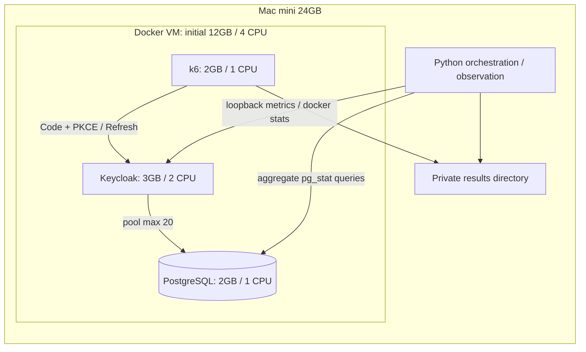
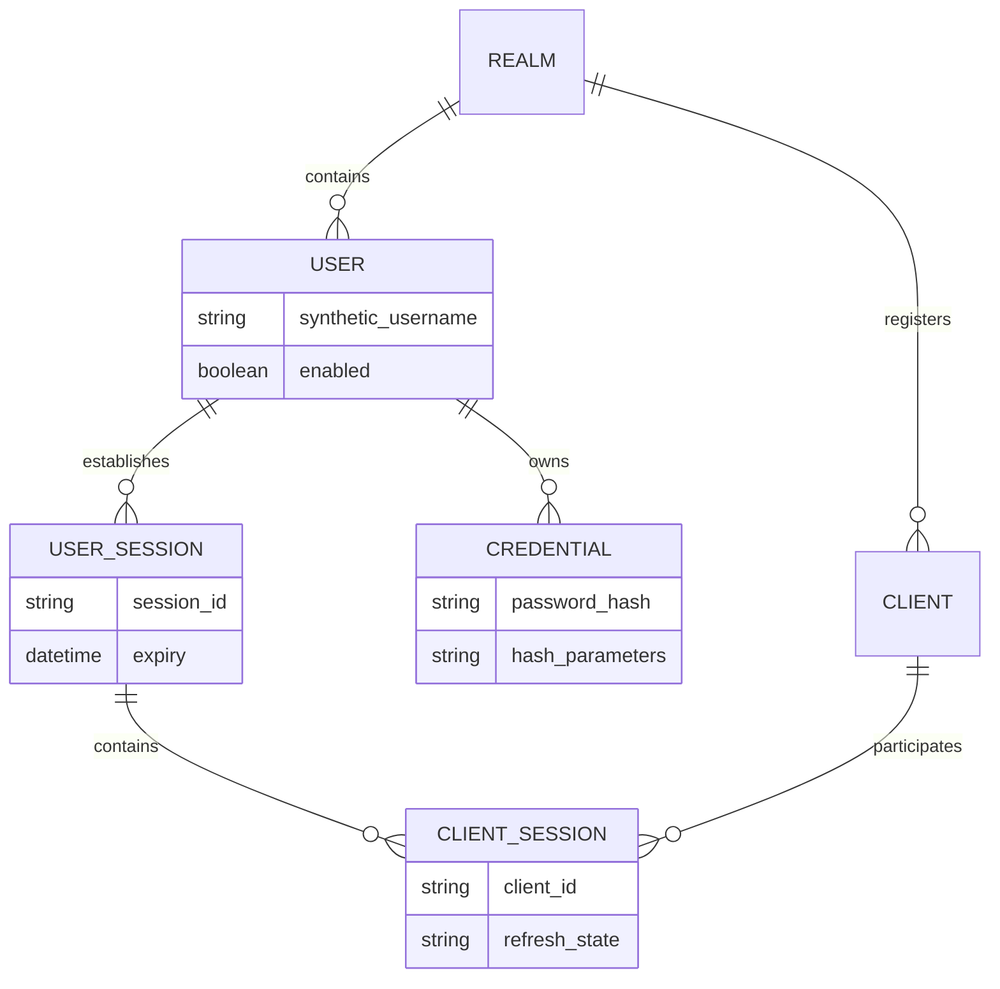

# 実験の構成とデータ

## 配置



DBはホストにポートを公開しない。KCはloopbackの18080/19000にだけ公開する。issuerはDocker内部の `http://keycloak:8080/realms/oidc-lab` で固定し、負荷生成器も同じ名前を使用する。ホストのブラウザで管理画面を操作する構成にはしていない。

## ログイン計測境界

```mermaid
sequenceDiagram
  participant K as k6 virtual user
  participant I as Keycloak
  participant D as PostgreSQL
  Note over K: start login timer / new cookie jar / verifier, state, nonce
  K->>I: GET authorize (code, S256 challenge)
  I-->>K: Login form
  K->>I: POST username and password
  I->>D: User lookup / credential / session operations
  D-->>I: Result
  I-->>K: 302 to callback with code and state
  Note over K: Do not fetch callback; validate state
  K->>I: POST token (authorization_code + verifier)
  I-->>K: Access / ID / Refresh tokens
  Note over K: Validate required claims / end timer
```

コールバック先にサーバーは不要。302のLocationを読み取り、次のHTTPリクエストとして外部へアクセスしない。テーマが変わりフォーム解析に失敗した場合、負荷測定を始める前のsmokeで検出する。

## 更新の所有権

```mermaid
sequenceDiagram
  participant S as k6 setup
  participant V as VU with unique id
  participant I as Keycloak
  S->>I: Real Code + PKCE login for each seed
  I-->>S: Separate refresh token per session
  S-->>V: Read own initial token by VU id
  loop Scheduled refresh arrivals
    V->>I: Own current refresh token
    I-->>V: Next refresh token
    Note over V: Replace local token; no sharing between VUs
  end
```

更新頻度を持つ多数の実端末のシミュレーションではなく、独立セッションで更新エンドポイントへ所定の到着率を与える負荷生成器。VUは同時処理枠であり、サービス利用者数ではない。

## 概念ER図



これは負荷の理解に必要な**概念モデル**で、Keycloak 26.7.3の物理テーブル名・列名・永続化形式を表したものではない。実装内部のテーブルをアプリから直接更新しない。トークンを通常の業務テーブルへ保存するERでもない。実際の永続化・キャッシュとSQLの詳細を記事で断定する場合は、対象バージョンのソースと実行時観測で確認する。
