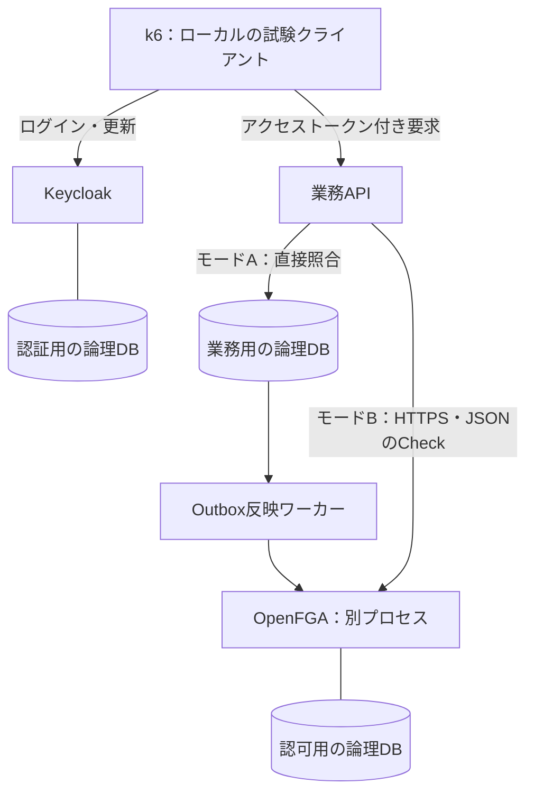

# Mac miniへの指示：OSS認証・認可の実装から実験完了まで

この文書を実行指示として、専用checkoutで実装・実測・集計・報告まで進めてください。計画、コードの準備、smoke成功だけで終了しないでください。

## ゴールと実行範囲

**ゴールは、Mac mini 24GB上で認証・認可の必須実験を完了し、結果から採用判断と限界を説明できる状態にすること。** クラウドは使用しません。GCP・AWS・Azureの構築、外部負荷生成器、有料サービスは不要です。コンテナや依存パッケージの取得以外の試験通信はローカルに限定します。

公開repo： https://github.com/higuuu/oidc-load-lab

作業時間の目安は土日約14時間。これは途中で成功扱いにする期限ではありません。必須項目が終わらなければ未完了として残し、必要な続行作業を示してください。失敗という実験結果と、試験を実行できていない状態を分けます。

今回の最終成果は「どの条件で正しく動き、どの負荷まで目標を守り、故障時にどう振る舞ったか」の測定結果です。単一Macの試験から、クラウドのAZ障害耐性・年間可用性・本番容量を保証しません。

## 背景：なぜこの実験をするのか

記事の主題は、一般消費者向けサービスを想定したOSS認証・認可アーキテクチャです。写真アルバム共有を例に、Keycloakが本人確認、業務APIが処理の許可・拒否、OpenFGAが共有関係の判定を担当します。

既存の「ログインに更新を加えたらCPU使用率が増えた」だけでは採用判断につながりません。今回は認可を実装し、正しい拒否・共有解除・API全体の負荷・依存先故障・復元を確かめます。

また、OpenFGAと専用DBは運用コストを増やします。小さく始める選択も評価するため、**同じ業務APIで、業務DBによる直接認可とOpenFGAによる認可を比較します。** どちらかを有利にするため条件を変更しないでください。

## 最初に読むものと開始地点

1. この文書（今回の最優先の指示）
2. `article/qiita.md`：構成と技術選定の意図
3. `article/oidc-measurement.md`、`results/final-report.md`、`results/experiment-ledger.md`：既存結果
4. `article/pr1-review.md`：検証範囲と問題点
5. `compose.yaml`、`scripts/lab.py`、`load/oidc.js`、集計・公開スクリプト

`docs/mac-mini-handoff.md` は初回の認証実験の歴史的な指示です。その中の「OpenFGAを対象にしない」「実Keycloak未確認」は今回の状態ではありません。この文書を優先します。

記事ブランチ `origin/article/qiita-experiment` に最新の文書があります。fetch後にHEADを確認し、この文書を含む版から `experiment/mac-mini-authz` など専用ブランチを作成してください。既存のdirty checkoutをreset・stash・上書きしないこと。必要なら別worktreeを使います。開始時と各比較セットでコミットSHAを記録します。

作業範囲は、実験用コードの追加・修正、依存物の取得、ローカルコンテナ起動、架空データの作成、指定試験、分析、公開可能な結果の作成です。通常の修正や試行ごとに確認を求めず進めてください。他のプロジェクトの停止・削除や、共有Docker VMの設定変更が必要な場合は影響を説明して調整します。

## 1. 実装する最小システム

UIや写真ファイルのアップロードは作りません。アルバムの架空メタデータを返すAPIで、認証から認可・業務DBアクセスまでを通します。

最初は1台のPostgreSQL内に、認証・認可・業務の論理DBと接続ユーザーを分ける構成にします。障害と資源を共有することを結果に明記します。既存認証ベンチマーク用Composeは保存し、新しい独立したCompose projectと専用ボリュームを用意してください。旧 `lab.py run` はDBを初期化するため、新しい実験の実行中に呼ばないこと。

Kubernetesは今回は必須にしません。Composeのサービス名で接続できるため、まずComposeで実験を完結させます。Podではなくコンテナ・プロセスの停止試験と記録します。GKE/EKS/AKSの検証済みとは書きません。

### APIと認可

最低限、アルバム取得・編集・共有追加・共有解除・共有変更の完了状態確認を実装します。

- Aliceは所有者、Bobは閲覧者、Carolは無関係な人として同じケースを両モードで確認。
- モードA：検証済み本人IDを使い、業務DBの所有者・共有先を直接照合。
- モードB：API内のHTTPクライアントまたはSDKから、別サービスのOpenFGAへCheck。HTTP API＋JSONを選び、接続を再利用。
- 本人確認はAPIで実施。JWTの署名・issuer・audience・期限・許可アルゴリズムを検証。公開鍵を保持し、未知の鍵IDの再取得は回数制限する。
- 利用者IDをリクエスト本文から信用しない。保護APIの全経路で認証・認可を通す。
- OpenFGAのモデルはowner/viewer、can_view/can_edit。モデルIDを固定。共有変更は所有者だけ許可。
- 401相当の認証失敗、403相当の認可拒否、503相当の依存先障害を分類。どの拒否・判定不能でも保護データを返さない。
- OpenFGAの認可結果は初期実験ではキャッシュしない。CheckはHIGHER_CONSISTENCY。実効設定を記録し、無効にしていないキャッシュを「なし」としない。
- 業務DBを共有状態の正本とする。Outbox、対象ごとの変更順序・バージョン・冪等な再試行を実装。
- 権限変更中は対象操作を一時拒否し、反映を確認してから変更完了にする。正本DBで変更中状態を確認し、古いイベントが新しい状態を上書きしないようにする。
- 「共有解除完了」はAPIの受付応答と区別する。解除完了後に開始した新規要求を判定対象とし、進行中要求の扱いを記録する。

使う実装言語・フレームワークは小さく選び、依存版を固定します。独自の暗号実装をしません。Keycloak/PostgreSQL/k6は既存の固定版を基本にし、OpenFGAは公式のARM64対応とモデルAPIを確認して版・digestを固定します。

### 通信・資源

新しい試験は、クライアント→Keycloak/APIとAPI/ワーカー→OpenFGAをローカルCAのTLSで保護します。証明書の名前・issuer・到達性を揃え、検証を無効にしないでください。DB接続はTLSあり/なしを明示し、未実装のTLSを実施済みとしません。秘密鍵はGit対象外です。

Kubernetes ServiceやクラウドLBは使わないので、それらの経路の性能は未検証です。API内部のJWT検証・OpenFGA Check・業務DBアクセス・全体の時間を別々に測れるようにします。

MacのSoC・OS・Docker・VM配分・アーキテクチャを確認し、他の実験を同時実行しません。新しい比較では既存の4 CPU/約12GB VMを起点とし、例としてKC 1.5 CPU/3GB、DB 1 CPU/2GB、APIとワーカー合計0.5 CPU/1GB、OpenFGA 0.5 CPU/1GB、k6 0.5 CPU/1GBを上限に配分します。TLS部品・観測器の追加分も予算化し、ホストのメモリ圧迫やswapを記録します。これは本番推奨値ではありません。

旧実験の再確認は旧配分、新しい比較は新配分として分けます。直接認可とOpenFGA認可で、API・DB・KC・生成器の上限と入力を同じにします。モードBの追加部品による資源増加も結果の一部です。

## 2. 完了に必要な実験

### E0：既存の測定不一致の確認

旧結果には同じ20ログイン/秒で、予備実験p99 27ms・CPU中央値45.63%、本比較p99 73〜75ms・CPU約126〜129%という差があります。

旧実装・旧配分で20ログイン/秒を、同じ初期化・warmup・測定時間で3回取り直してください。パスワードハッシュの実効設定、コード差分、初期化状態、セッション数、監視区間、VM配分、背景負荷を照合します。原因が特定できなければ未解明のまま残し、都合のよい旧値を基準に使いません。新しい固定条件で比較が成立するかを別に示します。理由の特定自体を無期限の作業にはしません。

### E1：認証・認可の正しさ

両モードで以下を自動テストし、実際のHTTP応答と保護データの有無を確認してください。

| ケース | 期待 |
|---|---|
| Aliceが自分のアルバムを閲覧・編集 | 許可 |
| Bobが共有されたアルバムを閲覧 | 許可 |
| Bobが編集・共有追加・解除 | 拒否 |
| Carolが閲覧、対象IDを他人のものへ差し替え | 拒否 |
| 未ログイン、改ざん署名、期限切れ、違うissuer/audience | 拒否 |
| 本文のユーザーIDだけAliceへ変更 | 権限を得られない |
| 存在しない対象、壊れた入力 | データ漏えいしない、分類したエラー |
| OpenFGAのタイムアウト・停止 | モードBは判定不能として拒否。無許可の成功なし |

誤許可が1件でもあれば、原因を直し、全ケースを取り直してから性能試験へ進みます。既知の誤許可を負荷のために放置しません。

### E2：共有解除・更新競合・再試行

Bobの閲覧を継続しながら、共有の追加・解除を各100サイクル実行します。受付時刻、反映時刻、完了応答、新規閲覧開始時刻と結果を記録します。

ワーカーを30秒停止して解除を要求し、保留の間に保護対象操作が許可されないこと、再開後に整合することを確認。重複イベント、古いイベント、連続する追加→解除→追加を入れ、最終の正本状態とOpenFGAの状態を照合します。

合格条件は、解除完了後の新規閲覧の誤許可0、古いイベントによる権限復活0、再開後に未反映が解消すること。変更中に許可が減る可用性コストも数えます。キャッシュや状態確認を片方のモードだけ省略して比較しないでください。

### E3：直接認可とOpenFGA認可の負荷比較

架空ユーザー1,000人、アルバム1,000件、各アルバムの共有先5人を初期データとします。本人の有効トークンとセッションは測定前に準備。データ生成seed、対象選択、共有数、許可80%/拒否20%を固定し、両モードで同じ要求を使います。期待した拒否をサーバ失敗に数えず、誤許可・誤拒否・予期しない5xxを別集計します。

1. 探索：認可対象APIを10→25→50→100→200要求/秒で増加。固定の60秒warmup＋180秒測定。
2. 目標違反や生成器不足が出た段階で増加を止め、原因を分類。
3. 両モードで試験が成立する共通の2水準を選び、各3回。低い方は余裕のある条件、高い方は探索上の境界に近い条件。境界が出なければ「探索上限まで」と書く。
4. 実行順をA→B、B→A、A→Bと交互にする。初期化・warmup・データを揃える。
5. 各アルバムの共有先を50人に増やし、高い共通水準を両モード各3回。共有数増加の影響を確認。

仮の受入目標：期待どおりの判定99.9%以上、誤許可0、保護API全体p99 300ms以内、予期しない5xx/timeout 0.1%以下、dropped iterations 0。成功と期待拒否は別々にも遅延を集計し、安い拒否が遅延を良く見せていないか確認します。閾値は結果を見て緩めません。

これはMac上の比較用目標で、月間可用性や本番SLOの達成証明ではありません。低い水準でしか成立しなくても、その結果を報告します。

### E4：ログイン・更新・閲覧の混合と、過負荷からの回復

E3で決めた共通の低いAPI水準に、ログイン1/秒・更新5/秒を同時に流します。両モード各3回、60秒warmup＋180秒測定。成立すれば、ログイン5/秒・更新20/秒を追加水準として試します。利用者の現実の更新周期と、負荷生成器が指定する到着率は区別します。

受入目標はE3に加え、ログインp99 2秒以内・更新p99 500ms以内、両認証フロー成功率99%以上。元の20/100を新しい構成へ無条件に流さないでください。

その後、同じ試行内で基準負荷120秒→API要求だけ2倍を60秒→基準負荷120秒に戻します。過負荷時の誤許可は0であること。復帰後、10秒窓で3窓連続して基準を満たすまでの時間を測り、暫定目標60秒と比較します。2倍で劣化しなければ過負荷に到達していないと報告し、架空の限界を出さないこと。

### E5：ローカル障害と回復

基準負荷の下で、以下を一つずつ実行します。停止60秒、再開後は最大180秒観測。各ケースを3回。HTTP/TCPの接続遮断は専用Composeネットワークや実験用プロキシに限定し、Mac全体の通信設定を変えないこと。

| 故障 | 確認 |
|---|---|
| OpenFGA停止・到達不能 | APIが一時エラーで拒否、無限再試行や誤許可なし。再開後の回復 |
| Keycloak停止 | 新規ログイン/更新の失敗。鍵を保持したAPIで有効JWTがどこまで使えるかを分けて記録 |
| 業務API停止・再起動 | 再起動時間、要求失敗、復帰後の正しい判定 |
| 共有PostgreSQL停止・再起動 | 三つの論理DBを共有した障害影響、接続再確立、未反映イベントの処理 |
| Outboxワーカー停止・再起動 | E2の保留・復旧結果を利用してよい。不要な重複試験はしない |

意図的な障害中の5xxを、通常時SLOの分母に混ぜません。誤許可0、再開後の整合、障害解除後60秒以内に10秒窓3窓連続で基準を満たすことを暫定目標にします。コンテナ停止はHA試験ではありません。PostgreSQL再起動をレプリカfailoverと呼ばないこと。

### E6：バックアップ・復元

架空データのバックアップを取り、**元の実験ボリュームを残したまま**別の専用ボリューム・Compose projectに復元します。認証用DB、業務DB、認可DBとモデル、必要な設定を対象にし、秘密情報を公開しません。

バックアップの取得基準時刻と復元対象を記録し、復元後にE1と共有状態の照合を実行。バックアップ後に共有解除を入れたケースも作り、古いバックアップの復元で許可が復活するかを検出します。最新の正本や変更記録を失った場合に復元だけで防げるとは主張せず、サービス再開の条件と残るデータ損失を報告します。

取得時間、復元・照合・サービス再開までの時間、復元できた時点を報告します。ローカルdump/restoreだけでRPO 5分や災害復旧を達成したとは扱いません。秘密値を含むDBダンプはGit対象外。

### E7：1時間の継続負荷

OpenFGAを使うモードBで、E4の成立した低い混合水準を1時間継続。メモリ・DB接続・イベント滞留が増え続けないか確認します。閾値違反・OOM・メモリ圧迫で停止したら、実時間と失敗を結果に残し、正常な1時間運転とは書きません。必要な修正後に再試行してください。1時間の成功を長期安定性の証明にしません。

## 3. 観測と判定

- 予定件数、実際の試行開始、実HTTP送信、完了、期待許可、期待拒否、誤許可、誤拒否、予期しないエラー、droppedを分ける。
- p50/p95/p99はフロー別・期待結果別・run別。runのp99の中央値を全リクエストのp99と呼ばない。
- API全体、JWT検証、OpenFGA Check、業務DBアクセスの計測境界を文書と図にする。
- KC・API・OpenFGA・DB・k6・ワーカー/TLS部品を観測。収集エラーと実サンプル間隔を記録し、欠測は0にしない。
- CPU 100%の単位、設定上限、VM全体の状態も記録。生成器が先に詰まった結果を対象サーバの限界としない。
- 各試行のコードSHA、版/digest、資源配分、seed、データ件数、共有数、通信/TLS条件、初期状態、開始終了、合否をmanifestに残す。
- 意味のあるコード・条件変更後は、影響する比較セットを同じ版で取り直す。全runを台帳へ残す。

## 4. 最終成果と完了判定

実験完了は、E0〜E7を実行し、集計・検証・報告まで揃った状態です。各項目に **合格／不合格／未実施／判定不能** を付けます。試験として有効な不合格結果も成果ですが、本番採用可とは結論しません。未実施・判定不能の必須項目が残る場合は実験未完了です。

成果物は既存結果を上書きせず、今回の接頭辞・ディレクトリに分けて作ります。

- 独立したCompose構成、API/ワーカー、固定版の認可モデル、架空データ、試験・集計スクリプト。
- 1コマンドずつ明確なinit/smoke/test/run/report/stop手順。既存コマンドにない機能を実行可能と書かない。
- `results/authz-final-report.md`：最初に結論・合否表・最大の制約。その後に環境と全試験結果。
- `results/authz-experiment-ledger.md`：失敗・除外を含む全run。
- `results/public/authz/`：秘密情報を除いた集約JSONと図。入力条件・集計根拠・コード版との対応を含める。
- 図：直接DB認可とOpenFGA認可のp99/成功率/資源、混合負荷、障害注入と回復の時系列、継続負荷のメモリ/接続/滞留。
- 記事への反映案：採用条件、測定した範囲、採用に残る課題。既存のクラウド図は未検証の参考設計として維持。

最終報告の結論は、例えば「構成X・データY・負荷Zで正しい拒否と目標遅延を確認。依存先停止時は閉じる方向に失敗し、再開後N秒で回復。共有DBにはこの障害影響がある。クラウドHAは未検証」のように、実際の数値で書いてください。結果が揃う前にこの例を埋めないこと。

## 5. 公開・作業終了

public前提です。実在ユーザー、JWT、認可コード、Cookie、パスワード、秘密鍵、DB接続文字列、個人パス、ホスト名、シリアル番号を公開しません。生ログ・ダンプ・生成設定はローカルに保持。ログには固定の分類と匿名の試験ケース番号を使います。

既存のallowlistに今回の安全なソース・集約結果を明示追加し、公開スクリプトと目視レビューで確認。`git add .` は使わず、ファイルを列挙して差分・機密検査を行います。構成検査は秘密値を出さない方法を選びます。Docker全体のpruneや他プロジェクトの停止は行いません。

レビュー可能なコミットにまとめ、実験用ブランチへ安全な成果だけをpushしてください。mainの変更、PRのマージ、Qiitaへの投稿は行いません。終了時は今回の専用コンテナだけを停止し、生データを保全します。最後に、実験完了か、未完了ならどの必須項目が残ったか、成果物とブランチ、失敗と制約を報告してください。
