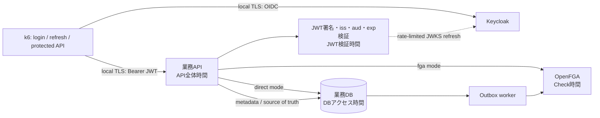
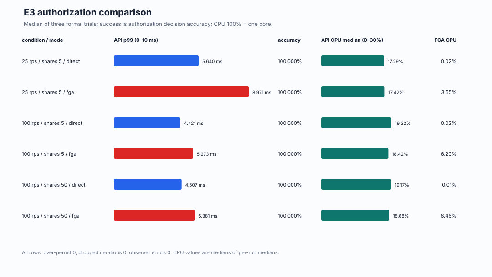
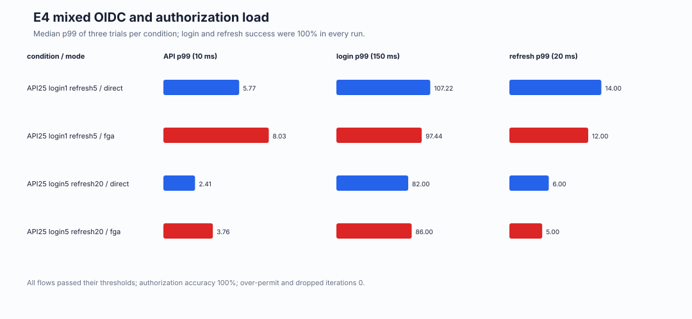
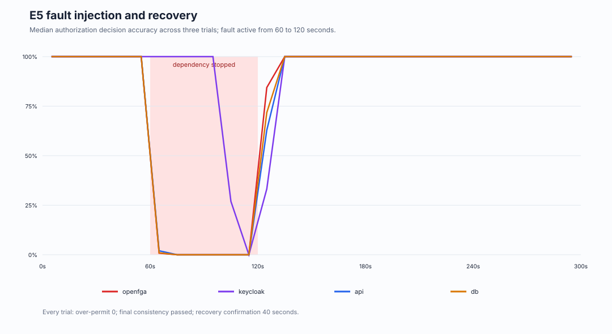
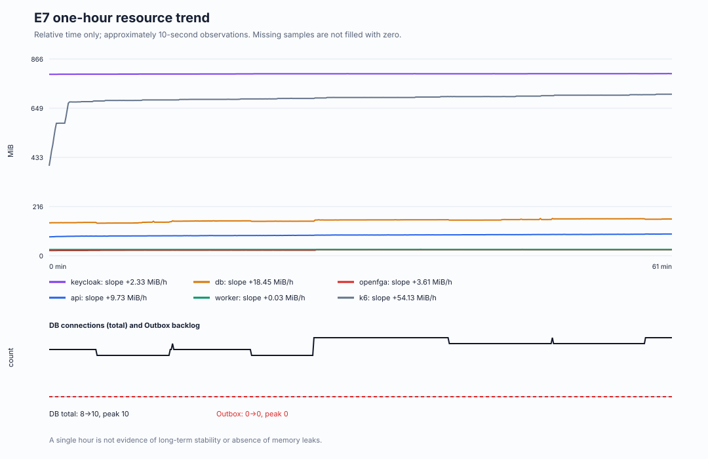

# Mac mini OIDC認証・認可 負荷実験 最終報告

## 結論

**一般消費者向けサービスのOIDC認証・認可基盤を、ログイン数だけでサイジングしてはいけない。** このMac mini上の実測では、新規ログインとは独立に、refresh、保護APIごとの認可判定、共有変更の非同期反映、依存障害からの回復が別の負荷軸・可用性軸になった。少なくとも次を分けて見積もる必要がある。

1. 新規ログイン到着率と、1ログインを構成する複数HTTP要求・パスワードハッシュ計算。
2. access token更新到着率。ログイン1/sに対してrefresh 5/sまたは20/sを同時に流した条件でも、要求数はログイン数と一致しない。
3. 保護API到着率。今回の混合条件ではログイン1/sに対して認可対象API 25/sを流した。
4. 直接DB認可か外部認可サービスか、共有関係数、整合性指定、キャッシュ方針。
5. 共有追加・解除の反映遅延と、変更中に安全側へ拒否する可用性コスト。
6. Keycloak、認可API、OpenFGA、共有DB、Outbox workerの個別障害と回復。

単一Mac、架空ユーザー1,000人、アルバム1,000件、Docker VM 4 CPU/約12GBという限定条件では、必須E0〜E7を実行した。E1〜E7の正式試行で誤許可は0だった。E3の成立上限は100 req/sであり、200 req/sはk6のVU不足でdropしたためサーバ限界ではない。E4のAPI 25→50 req/sは劣化せず、過負荷限界には到達していない。クラウドHA、本番SLO、長期安定性を証明する結果ではない。

## 完了判定

| 実験 | 判定 | 根拠 | 最大の制約 |
|---|---|---|---|
| E0 既存ログイン差異再現 | 合格 | 20 login/sを3回。成功率100%、drop 0。p99 72/27/74 ms | 2系統へ分かれる原因は未解明 |
| E1 認可の正しさ | 合格 | 現行コードで29/29、誤許可0 | 架空の3主体・限定操作 |
| E2 共有解除・競合・再試行 | 合格 | 両モード各100 cycle、完了後誤許可0、古いevent復活0 | 単一worker・単一DB |
| E3 直接DB/OpenFGA比較 | 合格 | 探索10〜200、共通25/100各3回、共有50各3回 | 200 req/sは生成器不足、サーバ境界未到達 |
| E4 混合・回復 | 合格 | 低/追加水準を両モード各3回、回復試験を両モード | 2倍APIで過負荷に到達せず |
| E5 障害・復元 | 合格 | 4故障×3回＋E2 worker停止。誤許可0、終了時整合 | コンテナ停止でありHA/failover試験ではない |
| E6 backup/restore | 合格 | 別project/volumeへ3 DB復元、29/29照合、旧権限復活を検知 | local logical dump、RPO/DR保証なし |
| E7 1時間継続 | 合格 | API 90,001件、login 3,600件、refresh 18,001件。全成功、誤許可0、drop 0 | 正のメモリ傾向があり、1時間を長期安定性とは扱わない |

判定閾値は実行前の指示書から変更していない。保護APIはaccuracy 99.9%以上、誤許可0、p99 300 ms未満、予期しない失敗0.1%以下、通常試行drop 0。OIDCはlogin成功率99%以上・p99 2秒未満、refresh成功率99%以上・p99 500 ms未満。障害中の意図的失敗は通常SLOの分母と分離した。

## 環境と測定境界

| 項目 | 実測・固定値 |
|---|---|
| ホスト | Mac mini、Apple M4、10 cores、24GB、arm64 |
| OS | macOS 26.6.2 |
| Docker | Engine 29.2.1、Compose v5.0.2、Desktop 4.63.0 |
| Docker VM | aarch64、4 CPU、12,001,992,704 bytes（約12GB） |
| Docker仮想disk | 160GB上限。実験開始時のホスト空きは約84GiB |
| Keycloak | 26.7.3、arm64。1.5 CPU / 3GiB |
| PostgreSQL | 17.6、arm64、digest `sha256:00bc8661…2929`。1 CPU / 2GiB |
| OpenFGA | 1.18.1、arm64、digest `sha256:efde89d2…6699`。0.5 CPU / 1GiB |
| k6 | 1.8.1、arm64、digest `sha256:23f22790…843f`。0.5 CPU / 1GiB |
| 業務API / worker | 0.4 CPU / 768MiB、0.1 CPU / 256MiB |
| データ | 架空ユーザー1,000、アルバム1,000、共有5または50/album |
| 認可要求 | 許可80% / 期待拒否20%、固定seed |
| OpenFGA | Check cache無効、`HIGHER_CONSISTENCY` |
| TLS | client→Keycloak/API、API/worker→OpenFGAはローカルCA検証。専用network内DB TLSは無効 |
| 背景負荷 | 他の既存コンテナを停止、`caffeinate`でsleep抑止。クラウド不使用 |

測定対象は、API全体、JWT検証、業務DBアクセス、OpenFGA Check、OIDC login/refreshである。Keycloak、API、OpenFGA、PostgreSQL、worker、k6のCPU/メモリ、3論理DBの接続数、Outbox滞留を約10秒間隔で観測した。Docker CPU 100%は1 core相当である。ブラウザ描画、人の入力、外部IdP、MFA、internet latencyは対象外。



API全体時間はclientが観測したTLS込みのHTTP往復で、JWT・DB・OpenFGAはAPI内の処理区間である。コンテナ資源は約10秒の別観測であり、個々のHTTP要求へ厳密には帰属させない。

正式比較のソースは次の固定SHAを使った。E3/E4通常比較は`b84dad0`、E4回復/E5は時刻parser修正後の`e00776f`、E7は`0ecdb0c`、出自記録を追加したE1/E2/E6最終再試験は`4ec7c64`。いずれも開始時dirty=false。結果集計コードは実験runtimeと分離した。

## 実行中に修正した不具合

smokeから始め、原因と失敗runを残して次を修正した。性能結果を見て閾値を緩める変更はしていない。

| 原因 | 最小修正 | 影響する再確認 |
|---|---|---|
| DB初期化scriptに実行権限がなくexit 126 | executable化 | stack smokeから再実行 |
| OpenFGA serviceにserver起動commandがなかった | `run`を明示 | health/E1再実行 |
| Keycloak 26でtest user profileがreadyにならない | realm user profileを補完 | 実login smoke |
| ローカル証明書のSAN/用途不足 | CA extensionを明示 | HTTPS全経路 |
| HTTPXがhost proxy環境を継承しJWKS取得失敗 | `trust_env=false` | JWT検証 |
| 改ざんJWT fixtureがbase64 paddingだけ変え、同じbytesになる場合 | signature先頭文字を変更 | E1全ケース |
| idempotency retryがpending gateより後で拒否された | owner確認付きretry lookupを先行 | E2 duplicate/retry |
| E2のpsql出力parserが表形式を前提 | `-At`出力へ固定 | E2全cycle |
| OpenSSL serial fileがrepo rootへ生成 | ignored runtime cert directoryへ限定 | public検査 |
| public bundle呼出しoption不一致 | 実在CLIへ統一 | static check |
| mixedのattempt/OIDC completed submetricがsummaryに出ず誤って失敗 | 対象threshold selectorを追加 | mixed smoke再実行 |
| 一回限りのk6コンテナをobserverが見失う | Compose service labelで動的発見 | observer smokeとE3正式比較を取り直し |
| k6の9桁小数秒をPython 3.10が解析不能 | 6桁へ正規化、回帰test | timeline smokeとE4/E5正式試験 |
| `pg_dump --no-owner`で復元table所有者がpostgresになった | 専用roleの所有者情報を保持 | E6再試行 |
| 復元E1の共有変更fixtureにIdempotency-Keyがなかった | 有効UUIDを明示し認可判定まで到達 | 現行E1 29/29、E6再試行 |
| mixedの`authz_completed`全体counterは記録されたが測定区間submetricが未出力 | 今後のthreshold selectorを追加。既存runは全体attempt＝全体completed、かつ測定区間started＝sent＝correct・unexpected 0のときだけ完了数を補完 | 全正式mixed/E7のraw counterを照合 |

失敗・途中・修正前runは削除していない。ローカルraw台帳は106 directory、公開台帳は全run IDと区分を持つ。正式証拠はraw側58 runにE0の3 runを加えた61 runである。最終aggregate前に中断した2 runは`aborted`として残し、同条件の正式再試験を完了した。必須E0〜E7に未実施・判定不能はない。

## E0：既存ログイン差異

元のOIDC stackを`ae6c748`のclean状態へ戻し、毎回DBを初期化して20 login/s、warmup 60秒＋測定180秒を3回実施した。

| trial | attempts | success | p95 / p99 | Keycloak CPU median / peak | observer error | drop |
|---:|---:|---:|---:|---:|---:|---:|
| 1 | 3,601 | 100% | 69 / 72 ms | 126.80 / 135.29% | 0 | 0 |
| 2 | 3,600 | 100% | 25 / 27 ms | 45.58 / 65.71% | 1 | 0 |
| 3 | 3,601 | 100% | 69 / 74 ms | 126.46 / 137.53% | 0 | 0 |

低CPU/低遅延のtrial 2と、高CPU/高遅延のtrial 1/3へ分かれる現象を再現したが、原因は未解明である。全trialを報告し、都合のよい一方だけを採用しない。この差だけでも、ログイン件数から一意にCPU・遅延を決める危険性を示す。

## E1：認可の正しさ

現行コードの正式再実行は29/29合格、誤許可0。直接DBとOpenFGAの両方で、owner閲覧/編集、viewer閲覧、viewer編集・共有変更拒否、他人ID差替え拒否、未認証、改ざん署名、期限切れ、wrong issuer/audience、存在しない/壊れた対象を確認した。OpenFGA停止時は保護APIが503でfail-closedし、保護データを返さなかった。

## E2：共有解除・競合・再試行

| mode | cycle | 解除完了 p50 / p95 / p99 / max | 追加完了 p50 / p95 / p99 / max | 完了後誤許可 | 変更中の安全側拒否 |
|---|---:|---:|---:|---:|---:|
| 直接DB | 100 | 91.58 / 129.45 / 135.97 / 144.88 ms | 90.61 / 123.92 / 132.12 / 134.25 ms | 0 | 200 |
| OpenFGA | 100 | 86.82 / 115.70 / 125.58 / 127.09 ms | 90.57 / 127.87 / 130.18 / 131.87 ms | 0 | 200 |

両モードで、解除後の新規閲覧誤許可0、追加後の誤拒否0、duplicate idempotency、古いevent抑止、追加→解除→追加の順序、最終正本/OpenFGA一致、pending 0を確認した。workerを30秒停止した試験は、保留中30/30を安全側拒否、予期しない結果0、再開後4,175.24 msで反映完了、以後Bobは403だった。安全側設計は変更中の可用性低下を伴う。

## E3：直接DB認可とOpenFGA認可

探索では10/25/50/100 req/sが両モードで成立した。200 req/sは直接DBで70、OpenFGAで170 dropped iterationがあり不成立。p99は3.73/4.13 ms、API CPUも約27%以下だったため、認可serverではなくk6の事前割当VU不足と分類した。したがって100 req/sは「探索上限まで成立」であり、server限界ではない。

| 条件 | 直接DB p99 median（min–max） | OpenFGA p99 median（min–max） | accuracy | 誤許可 / drop / observer error |
|---|---:|---:|---:|---:|
| 25 req/s、共有5 | 5.640（5.634–5.808）ms | 8.971（8.586–9.298）ms | 全run 100% | 全run 0 |
| 100 req/s、共有5 | 4.421（4.289–4.539）ms | 5.273（5.175–5.482）ms | 全run 100% | 全run 0 |
| 100 req/s、共有50 | 4.507（4.401–4.604）ms | 5.381（5.238–5.532）ms | 全run 100% | 全run 0 |



共有数を5から50へ10倍にしても、このモデル・query・規模ではp99の顕著な悪化は見えなかった。これは関係tupleの増加が一般に無コストという意味ではない。より深い関係graph、list操作、cache、複数nodeは未検証である。

## E4：ログイン・更新・認可の混合

| 条件 | mode | API p99 median（min–max） | login p99 median（min–max） | refresh p99 median（min–max） | 成功率 / 誤許可 / drop |
|---|---|---:|---:|---:|---:|
| API25 + login1 + refresh5 | 直接DB | 5.770（5.599–5.900）ms | 107.22（102.26–120.84）ms | 14.00（13.01–16.01）ms | 全run 100% / 0 / 0 |
| 同上 | OpenFGA | 8.026（7.623–8.268）ms | 97.44（95.21–125.20）ms | 12.00（9.00–13.00）ms | 全run 100% / 0 / 0 |
| API25 + login5 + refresh20 | 直接DB | 2.412（2.236–2.527）ms | 82.00（79.00–86.01）ms | 6.00（4.00–6.00）ms | 全run 100% / 0 / 0 |
| 同上 | OpenFGA | 3.764（3.523–3.768）ms | 86.00（83.01–104.00）ms | 5.00（4.00–6.00）ms | 全run 100% / 0 / 0 |



追加水準で遅延が下がったのは、keep-alive、connection pool、JIT、熱状態などを含む観測結果であり、「負荷を増やすと速くなる」という因果主張には使わない。各条件内は3回・交互順序で再現性を確認した。

回復試験は基準120秒→APIのみ2倍60秒→基準120秒で実施した。

| mode | API p99 基準→2倍→復帰 | 誤許可 | drop | 3窓確認 | 解釈 |
|---|---:|---:|---:|---:|---|
| 直接DB | 5.73→6.40→5.84 ms | 0 | 0 | 30秒 | 2倍で過負荷未到達 |
| OpenFGA | 8.21→7.12→7.88 ms | 0 | 0 | 30秒 | 2倍で過負荷未到達 |

## E5：ローカル障害と回復

各caseをOpenFGA modeの基準負荷で3回、停止60秒・再開後180秒観測した。全12 runで故障効果あり、誤許可0、終了時整合性3/3、観測欠測0、3窓連続確認40秒だった。k6 exit 99は意図的故障中の通常threshold違反であり、故障試験の合否はfail-closed・回復・整合性で別判定した。

| 故障 | trial | 障害中の保護API accuracy | login success | refresh success | drop | 回復確認 |
|---|---|---:|---:|---:|---:|---:|
| OpenFGA | 1/2/3 | 0.13 / 0.13 / 0.20% | 100% | 100% | 0/0/0 | 全40秒 |
| Keycloak | 1/2/3 | 100 / 66.73 / 71.13% | 1.69 / 1.75 / 3.51% | 2.47 / 2.51 / 2.41% | 55/50/38 | 全40秒 |
| 業務API | 1/2/3 | 0.14 / 0.34 / 0.28% | 100% | 100% | 0/0/0 | 全40秒 |
| 共有PostgreSQL | 1/2/3 | 全0.14% | 0 / 0 / 1.69% | 16.90 / 15.86 / 15.52% | 0/0/0 | 全40秒 |



OpenFGA/API/DB停止中の低accuracyは、期待allowが安全側の5xx/拒否になったためで、誤許可ではない。Keycloak停止では事前取得した有効JWTと保持済みJWKSにより保護APIが一部継続したが、試行差はtoken残存寿命に依存した。新規login/refreshはほぼ停止した。共有PostgreSQL停止は認証・業務・認可の3論理DBへ同時影響し、障害半径が大きい。

Outbox worker停止はE2を再利用した。停止中は変更対象を安全側へ拒否し、再開後に未反映eventが解消した。これはsingle container restartであり、HAやPostgreSQL replica failoverの検証ではない。

## E6：バックアップ・別volume復元

3論理DB、OpenFGA model、runtime設定、ローカルCA/certを対象にした。秘密値を含むdump・設定・鍵はignored runtimeだけに保存し、Gitへ含めない。元volumeを残し、timestamp付き別Compose project/volumeへ復元した。

| 指標 | 実測 |
|---|---:|
| dump取得 | 1,506.51 ms |
| DB復元 | 6,854.76 ms |
| 復元開始→service ready | 32,654.26 ms |
| E1/共有照合 | 4,623.14 ms |
| backup後の共有解除完了 | 91.01 ms |

元環境ではbackup後の解除によりBobは403になった。古いbackupを復元するとBobの200が復活し、そのリスクを検出できた。復元時点のE1は29/29、誤許可0。これは「古い認可状態も正確に復元する」ことを示し、backup後の正本変更を自動的に守るものではない。再開前に更新履歴とのreconcileが必要である。local logical dumpだけからRPO 5分、災害復旧、別host復旧を主張しない。

## E7：1時間継続負荷

OpenFGA mode、共有5、API 25 req/s、login 1 req/s、refresh 5 req/sで、warmup 60秒後に3,600秒を連続実行した。

| 指標 | 実測 |
|---|---:|
| protected API planned / started / sent / completed | 90,000 / 90,001 / 90,001 / 90,001 |
| protected API accuracy / 誤許可 / 誤拒否 / unexpected / drop | 100% / 0 / 0 / 0 / 0 |
| protected API p50 / p95 / p99 / max | 4.139 / 7.159 / 8.409 / 179.807 ms |
| login attempted / success / p99 | 3,600 / 100% / 99 ms |
| refresh attempted / success / p99 | 18,001 / 100% / 14 ms |
| observer error / Outbox peak | 0 / 0 |
| host memory free（前→後） | 50% → 49% |

constant-arrival-rateの境界でplannedより1件多く開始されたが、全90,001件を分母にした。k6 summaryには`authz_completed`全体値91,501があり全体attemptと一致する一方、測定区間submetricが未出力だった。このrunでは測定区間のstarted＝sent＝correct 90,001かつunexpected 0でもあるため、completed 90,001と補完した。今後は同submetricを直接出すselectorを追加済みである。

| service | memory 最初→最後の四分位中央値 | 全区間 / 後半 slope | peak | CPU median / peak |
|---|---:|---:|---:|---:|
| PostgreSQL | 146.4 → 162.3 MiB | +18.45 / +12.17 MiB/h | 163.8 MiB | 3.01 / 11.28% |
| Keycloak | 799.5 → 801.4 MiB | +2.33 / +1.31 MiB/h | 801.8 MiB | 11.97 / 21.04% |
| OpenFGA | 24.11 → 26.33 MiB | +3.61 / +0.07 MiB/h | 26.82 MiB | 2.68 / 4.24% |
| API | 87.00 → 94.08 MiB | +9.73 / +8.41 MiB/h | 95.61 MiB | 14.33 / 17.18% |
| worker | 27.49 → 27.49 MiB | +0.03 / +0.02 MiB/h | 27.74 MiB | 0.50 / 0.67% |
| k6 | 683.6 → 706.7 MiB | +54.13 / +30.05 MiB/h | 711.0 MiB | 7.01 / 14.56% |

DB接続はauth 3→2（peak 4）、app 3→4（peak 4）、authz 2→4（peak 4）。Outboxは最初・最後・peakすべて0だった。資源上限到達、OOM、接続枯渇、滞留は観測しなかったが、DB・API・k6を中心に正のメモリ傾向が残った。1時間内で発散を判定できないため、採用前に数時間〜日単位のsoakとheap/connection内訳を追加する。



1回の1時間成功は長期安定性・memory leak不存在・月間可用性の証明ではない。失敗した場合も停止時刻と状態をそのまま採用する。

## 全run、失敗、選別方針

全runは [authz-experiment-ledger.md](authz-experiment-ledger.md) に列挙した。公開用 [run-set.json](public/authz/run-set.json) はformal、diagnostic、superseded、incompleteを区別する。主な失敗・除外は次のとおり。

- 初期E1 smoke：stack/JWT fixture等の不具合。修正後全29件を取り直した。
- observer修正前のE3：k6 resourceが欠測したため正式比較から除外し、同一条件を全て取り直した。
- E3共有50の2 run：最終aggregate前に中断。`aborted`として保持し、同条件の正式3試行を取り直した。
- 200 req/s探索：drop 70/170の有効な不合格。サーバ限界に読み替えない。
- 初回mixed：Counter submetric集計不備。flow自体の成功と集計失敗を区別し、修正後smokeと正式比較を実行。
- 初回timeline smoke：9桁小数秒parser failure。rawを保持し修正後再実行。
- E6初回：DB所有者欠落でOpenFGA migration失敗。2回目：fixtureが400で認可に未到達。いずれも別volumeを保持し、修正後に全工程を再実行。

正式runは「成功したものを後から選んだ」のではなく、事前条件、固定SHA、dirty=false、必要観測が揃う比較セットとして定義した。正式探索内の200 req/s不合格も残した。

## 再現手順

専用branchのclean checkout、Docker Desktop 4 CPU/約12GBで次を実行する。最初にsmokeとE1を通し、誤許可があれば負荷試験へ進まない。

```sh
python3 scripts/authz_lab.py init
python3 scripts/authz_lab.py start --reset
python3 scripts/authz_lab.py seed --shares 5
python3 scripts/authz_lab.py e1
python3 scripts/authz_lab.py e2
```

E3/E4/E5/E6/E7の正確な引数・実行順は [mac-mini-authz-handoff.md](../docs/mac-mini-authz-handoff.md) と公開 [run-set.json](public/authz/run-set.json) のmanifest抜粋を参照する。rawから公開集計を再生成するコマンドは次である。

```sh
python3 scripts/analyze_authz_results.py
python3 scripts/public_bundle.py
```

## 限界

- 1台のMac mini、Docker Desktop VM、単一node、単一worker、単一共有PostgreSQLである。
- 一般消費者向けを想定した架空分布であり、実traffic trace、bot、不正login、MFA、外部IdP、social loginはない。
- OpenFGA modelは単純なowner/viewerで、深いgraph、ListObjects、大規模tuple、cacheありを測っていない。
- JWT/JWKS、local TLS、network、connection pool、JIT、host熱状態を含む。この結果を別machine/clusterへ外挿できない。
- E0の二峰性原因、E3のserver飽和点、E4の過負荷点は未解明・未到達である。
- E5はprocess/container停止であり、multi-node quorum、load balancer、rolling deploy、region障害、HAを含まない。
- E6はlocal logical dump/restore。暗号化backup、remote保管、定期restore drill、PITR、RPO/RTO契約を検証していない。
- E7は1時間だけである。

## 公開候補ファイル

- `authz/`、`scripts/authz_lab.py`、`scripts/analyze_authz_results.py`、対応test。
- 本報告、全run台帳。
- `results/public/authz/run-set.json`、`summary.json`、4つのSVG。
- `article/authz-reflection.md`。

`.authz-runtime/`、`results/authz-raw/`、既存/今回のraw run directory、console、samples、observer、DB dump、realm import、`.env`、鍵、tokenは公開しない。公開allowlistとsecret pattern検査に加え、staged diffを目視確認してからpushする。
