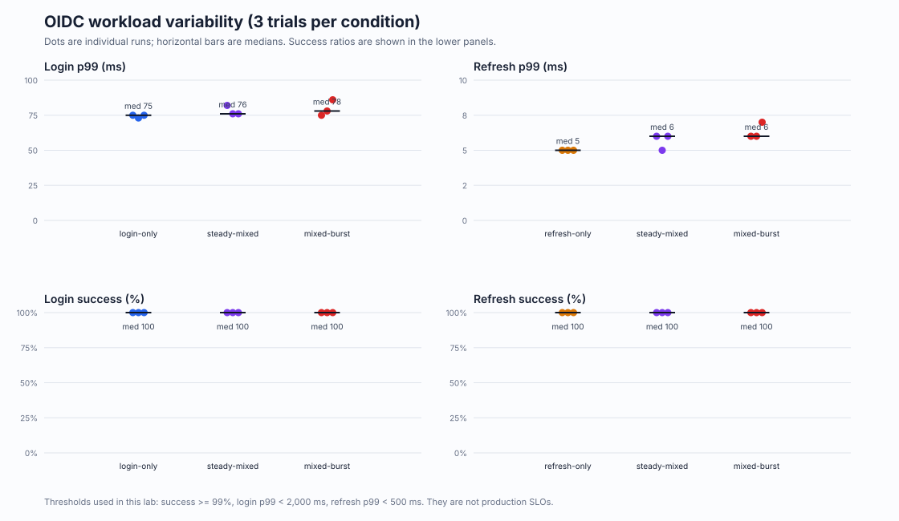
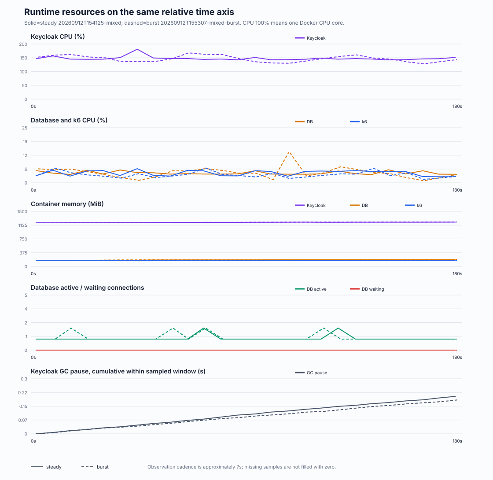

# Mac mini OIDC負荷実験 最終報告

実施日: 2026-09-12（JST）
対象: Keycloak 26.7.3 / PostgreSQL 17.6 / k6 1.8.1 / Mac mini 24GB

## 1. 結論

**この実験範囲では、ログイン数だけでOIDC利用基盤をサイジングするのは不十分である。** 20 login flows/sだけを流した3試行と、同じログイン到着率に100 refresh requests/sを加えた3試行を比べると、ログイン成功率はいずれも100%、p99中央値は75msから76msへの変化に留まった。一方、Keycloak CPU中央値は126.59%から145.75%へ19.16ポイント（約15.1%）増えた。100%はDocker上のCPU 1コア相当である。

つまり、この条件では更新負荷が直ちにログインSLO違反を起こしたわけではないが、**ログインの成功率と遅延だけを見ていると、更新が消費したCPU余力を見落とす**。一般消費者向けサービスの設計では、ログイン到着率とは別に、アクティブセッション数、更新周期、クライアントのジッター、再接続時の集中からrefresh到着率と形状をモデル化し、混在時の資源と遅延を測る必要がある。

同じ平均100 refresh/sを0〜200/sに変動させた混在3試行では、ログインp99中央値78ms、refresh p99中央値6ms、Keycloak CPU中央値146.36%で、一定混在の76ms、6ms、145.75%に近かった。全件成功しdroppedも0だったため、この負荷水準・15秒ランプ・約7秒観測周期では、更新集中による明確な容量劣化は確認していない。「burstは影響しない」という一般化もできない。

これは最大性能や本番容量の証明ではない。単一Mac、コンテナ内HTTP、180秒、合成ユーザー、生成器同居で得た比較結果である。

## 2. 環境、コード、修正

### 実機環境

| 項目 | 実測条件 |
|---|---|
| ホスト | Mac mini / Apple M4 / arm64 / 10 CPU cores / 24GB |
| OS | macOS 26.6.2 |
| Docker | Desktop 4.63.0 / Engine 29.2.1 / Compose v5.0.2 |
| Docker VM | aarch64 / 4 CPU / `MemTotal=12001992704`（約12GB） |
| Docker仮想ディスク | 当初120GB。空き48MiBで起動失敗後、既存データを削除せず上限160GBへ変更 |
| Python / Node.js | 3.10.5 / 24.13.1 |
| イメージ | Keycloak、PostgreSQL、k6すべて`linux/arm64` |
| 背景条件 | 既存コンテナを停止、測定中は`caffeinate`でスリープ抑止 |
| Keycloak上限 | 2 CPU / 3GB、heap 1〜2GB |
| PostgreSQL上限 | 1 CPU / 2GB、shared_buffers 256MB |
| k6上限 | 1 CPU / 2GB |
| パスワード処理 | Argon2id v1.3、iterations 5、memory 7168、parallelism 1、hashLength 32 |

ホスト名、シリアル番号、他プロジェクト名、完全な環境変数、秘密ハッシュ本体は記録していない。詳細は [environment.md](environment.md)。

### コード版と差分

- 開始点および指示書追加コミット: `f06b29eff4b69e57403418e27368dc05faa07b00`。
- 本比較の実行コミット: `040928d71e3e0085bf2d653c31f31c45e6d6ca70`、worktree clean。
- `scripts/report.py`: k6のRFC3339時刻が7〜9桁または5桁の小数秒を持つ場合もPython 3.10で読めるよう、6桁へ安全に正規化。測定区間だけのKC/DB/k6 CPU・メモリ、DB待ち、Agroal、heap、GC、HTTP、password validationを役割名だけで集計。
- `scripts/lab.py`: manifestへGit HEAD/dirty、Docker VM architecture/CPU/memory、イメージarchitectureを追加。
- `scripts/analyze_results.py`: 明示したrun-setから公開用集計JSONと3図を生成。生時刻・コンテナ名・生ログは出力しない。

修正は認証フロー、PKCE、Argon2、到着率、閾値を緩和していない。集計修正前の元サンプルは保持し、修正後に再集計した。本比較は修正コミット後の同一条件で全試行を取り直した。

## 3. smoke、観測受入、探索

### 失敗を含む立ち上げ

最初の `20260912T124843-smoke` はKeycloakのARM64ビルドとPostgreSQL起動後、Docker仮想ディスクの空き不足でKeycloak DB migrationが失敗した。readiness前のためmanifestはなく、性能結果には含めない。120GB上限で空きが48MiBだったため、既存Dockerデータはpruneせず上限を160GBへ変更した。

次の `20260912T140319-smoke` は1/1成功、607ms、dropped 0、終了コード0。実Keycloakに対し、認可画面取得、資格情報送信、code受領、PKCE S256交換、refreshまで通過した。1件だけなのでp99容量値としては扱わない。

低負荷の観測受入 `20260912T140623-mixed` はL=1/s、R=5/s、60秒。login 61/61、p99 60.4ms、refresh 300/300、p99 20.01ms、dropped 0、サンプル完全。観測19点、間隔6.217〜7.277秒、連続エラーなし。KC/DB/k6、JVM、HTTP、Agroalを取得できた。これは計測経路の確認で、本比較へ混ぜていない。

### 単独探索

| run | mode | rate | 予定/試行/成功 | 成功率 | p99 ms | dropped | 判定 |
|---|---|---:|---:|---:|---:|---:|---|
| `20260912T141124-login` | login | 1/s | 180/181/181 | 100% | 109.2 | 0 | 合格 |
| `20260912T141653-login` | login | 5/s | 900/900/900 | 100% | 87 | 0 | 合格 |
| `20260912T142221-login` | login | 10/s | 1,800/1,801/1,801 | 100% | 71 | 0 | 合格 |
| `20260912T142830-login` | login | 20/s | 3,600/3,601/3,601 | 100% | 27 | 0 | 合格 |
| `20260912T143340-refresh` | refresh | 5/s | 900/900/900 | 100% | 19 | 0 | 合格 |
| `20260912T143911-refresh` | refresh | 20/s | 3,600/3,601/3,601 | 100% | 16 | 0 | 合格 |
| `20260912T144443-refresh` | refresh | 50/s | 9,000/9,001/9,001 | 100% | 7 | 0 | 合格 |
| `20260912T145014-refresh` | refresh | 100/s | 18,000/18,000/18,000 | 100% | 5 | 0 | 合格 |

探索した上限L=20/s、R=100/sはいずれも暫定基準を満たし、R=100/sでk6 peak CPU 4.97%、DB waiting 0だったため本比較に採用した。上限を超える探索はしておらず、容量限界ではない。探索のL=20/sは後続の同率ログイン3試行よりp99とKeycloak CPUが著しく低かった。原因は確定しておらず、結果を削除せず台帳へ残した。比較結論は、同じコード・固定条件で順序を変えた本比較3試行を使う。

全23試行の実行順、失敗・除外理由は [experiment-ledger.md](experiment-ledger.md) にある。

## 4. 本比較3試行

固定条件はL=20 login flows/s、R=100 refresh requests/s、測定180秒、warmup 60秒、各シナリオ100VU。混在は合計200VUを事前割当する。ログイン1フローは通常3 HTTPリクエスト、refreshは1リクエストであり、両rateは同じ単位ではない。

試行順は、1巡目 login→refresh→mixed、2巡目 mixed→refresh→login、3巡目 refresh→login→mixed。必須9試行の完了を優先した後、mixed-burstを3回連続で実施した。

### ログイン単独

| run | 予定/試行/成功 | 成功率 | p95/p99 ms | KC CPU med/peak % | DB CPU med/peak % | k6 CPU med/peak % | DB wait | 判定 |
|---|---:|---:|---:|---:|---:|---:|---:|---|
| login-r1 | 3,600/3,601/3,601 | 100% | 69/75 | 125.68/138.90 | 0.71/2.36 | 1.49/2.85 | 0 | 合格 |
| login-r2 | 3,600/3,601/3,601 | 100% | 69/73 | 126.59/137.91 | 0.72/2.34 | 1.52/3.22 | 0 | 合格 |
| login-r3 | 3,600/3,601/3,601 | 100% | 70/75 | 128.74/141.14 | 0.74/2.31 | 1.46/2.85 | 0 | 合格 |
| **中央値（範囲）** | — | **100% (100–100)** | —/**75 (73–75)** | **126.59 (125.68–128.74)** | **0.71 (0.71–0.74)** | **1.49 (1.46–1.52)** | **0** | **3/3** |

### 更新単独

| run | 予定/試行/成功 | 成功率 | p95/p99 ms | KC CPU med/peak % | DB CPU med/peak % | k6 CPU med/peak % | DB wait | 判定 |
|---|---:|---:|---:|---:|---:|---:|---:|---|
| refresh-r1 | 18,000/18,000/18,000 | 100% | 4/5 | 30.02/36.33 | 4.64/7.24 | 3.17/4.99 | 0 | 合格 |
| refresh-r2 | 18,000/18,000/18,000 | 100% | 4/5 | 29.87/37.83 | 4.72/8.56 | 3.23/4.90 | 0 | 合格 |
| refresh-r3 | 18,000/18,000/18,000 | 100% | 4/5 | 30.64/50.63 | 4.71/6.79 | 3.10/4.86 | 0 | 合格 |
| **中央値（範囲）** | — | **100% (100–100)** | —/**5 (5–5)** | **30.02 (29.87–30.64)** | **4.71 (4.64–4.72)** | **3.17 (3.10–3.23)** | **0** | **3/3** |

### 一定混在

| run | login 予定/試行/成功, p95/p99 | refresh 予定/試行/成功, p95/p99 | 成功率 | KC CPU med/peak % | DB CPU med/peak % | k6 CPU med/peak % | DB wait | 判定 |
|---|---|---|---:|---:|---:|---:|---:|---|
| mixed-r1 | 3,600/3,600/3,600, 71/82 | 18,000/18,001/18,001, 4/6 | 100% / 100% | 145.75/154.84 | 3.96/5.93 | 5.03/5.60 | 0 | 合格 |
| mixed-r2 | 3,600/3,600/3,600, 70/76 | 18,000/18,001/18,001, 4/5 | 100% / 100% | 144.40/155.21 | 4.20/20.08 | 2.99/3.28 | 0 | 合格 |
| mixed-r3 | 3,600/3,601/3,601, 70/76 | 18,000/18,001/18,001, 4/6 | 100% / 100% | 145.86/181.16 | 4.05/5.89 | 5.12/6.40 | 0 | 合格 |
| **中央値（範囲）** | **p99 76 (76–82)** | **p99 6 (5–6)** | **100% / 100%** | **145.75 (144.40–145.86)** | **4.05 (3.96–4.20)** | **5.03 (2.99–5.12)** | **0** | **3/3** |

各runのp99を平均していない。表の集約はrunごとのp99の中央値と最小最大である。ログインは各run 3,600〜3,601サンプル、refreshは各run 18,000〜18,001サンプル。予定より1件多い試行はk6 arrival-rate executorの測定境界によるもので、予定・試行・成功を分けた。全runで `complete_samples=true`。

## 5. 更新集中の比較

`mixed-burst` は平均R=100/sを保ち、15秒ごとにR→2R→R→0→Rとなるランプを60秒周期で3回繰り返す。瞬間的な全端末同時更新や実クライアントのTTL同期を再現したものではない。

| run | login 予定/試行/成功, p95/p99 | refresh 予定/試行/成功, p95/p99 | 成功率 | KC CPU med/peak % | DB CPU med/peak % | k6 CPU med/peak % | DB wait | 判定 |
|---|---|---|---:|---:|---:|---:|---:|---|
| burst-r1 | 3,600/3,601/3,601, 71/75 | 18,000/18,001/18,001, 4/6 | 100% / 100% | 146.36/167.14 | 4.27/8.43 | 3.07/5.26 | 0 | 合格 |
| burst-r2 | 3,600/3,601/3,601, 70/78 | 18,000/18,001/18,001, 4/6 | 100% / 100% | 147.24/167.90 | 4.40/14.14 | 3.47/6.67 | 0 | 合格 |
| burst-r3 | 3,600/3,600/3,600, 71/86 | 18,000/18,001/18,001, 4/7 | 100% / 100% | 144.82/161.89 | 4.32/7.27 | 3.65/7.30 | 0 | 合格 |
| **中央値（範囲）** | **p99 78 (75–86)** | **p99 6 (6–7)** | **100% / 100%** | **146.36 (144.82–147.24)** | **4.32 (4.27–4.40)** | **3.47 (3.07–3.65)** | **0** | **3/3** |

図2・3は恣意的な最良runではなく、各条件のlogin p99中央値に位置するrunを規則的に選んだ代表時系列である。5秒バケットの最後の端数は除外し、予定曲線はバケット中央のtarget。開始と完了が別バケットになる可能性がある。

資源観測は約7秒周期で、欠測を0補完していない。DB activeには観測クエリ自身が含まれ得る。全比較でDB waiting peakとAgroal awaiting peakは0だった。一定混在とburstの代表時系列にはCPUの揺れがあるが、同時増加だけから因果は主張しない。

## 6. 暫定SLO、生成器、解釈可能範囲

探索および本比較で試した最大L=20/s、平均R=100/s、peak R=200/sの範囲は、成功率99%以上、login p99 < 2,000ms、refresh p99 < 500ms、dropped 0という研究用基準をすべて満たした。これは本番SLOではない。

k6 peak CPUは本比較最大7.30%、メモリpeakは約175MiB、dropped 0であり、この範囲で生成器が先に詰まった兆候はない。一方Keycloakは2 CPU上限に対し、一定混在のpeakが最大181.16%まで達した。上限を越えていないため限界点は不明であり、余裕を根拠に線形外挿してはならない。

測定区間のKeycloak HTTP/password validation/GC値は約7秒間隔のsnapshot差分で、区間端を正確に挟まないため件数の正本には使わない。フロー件数の正本はk6の `phase=measure` カスタムメトリクスである。

## 7. 限界と次の実験

- 単点: 単一ホスト・単一Keycloak構成であり、HA、ロードバランサ、RPO/RTO、フェイルオーバーは未検証。
- TLS、ブラウザ描画、人の入力、MFA、外部IdP、メール/OTP、WAF、攻撃耐性は未検証。
- 架空ユーザー1,000人、同一ランダム実験用パスワード、単一realm/client。実利用者数への換算はできない。
- 180秒×3回であり、長時間のheap、GC、DB膨張、熱、経時変化は評価していない。
- 生成器と対象が同じDocker VMの4 CPUを共有する。k6単独資源は低いが、ホスト共有の影響を完全には分離できない。
- mixed-burstは15秒ランプ、観測は約7秒周期で、短いピークを粗くしか捉えない。3試行を連続実施したため順序・熱の影響も残る。
- 探索L=20/sの低いp99/CPUと本比較の差の原因は未確定。短い試行の環境変動を示すため、探索結果を選別せず残した。
- ID Tokenのstate/nonce/issuer/audience/expiryは確認するが、生成器は署名を検証しない。完全なOIDC RP適合試験ではない。

**次に一つ実験するなら、別ホストから負荷を生成し、ログインrateを固定したままrefreshの平均rateとburst周期を段階的に上げ、Keycloak 2 CPU飽和前後を各5〜10分・ランダム順で5試行測る。** これにより生成器同居を外し、更新到着率とログインp99/CPUのdose-response、burstの短時間影響、長めのGC挙動を切り分けられる。

## 8. Qiita記事案

### 見出し構成

1. ログインTPSだけで認証基盤を見積もる違和感
2. ログインとRefresh Token更新は何が違うか
3. Mac mini上に作った再現可能なKeycloak実験環境
4. smokeで実Keycloak・PKCE・ARM64を先に検証する
5. 単独探索からL=20/R=100を選ぶ
6. ログイン単独・更新単独・一定混在を3回ずつ比較
7. 同じ平均更新数でも到着形状を変える
8. 遅延はほぼ同じでもCPU余力は減った
9. この結果から言えること／言えないこと
10. 本番サイジングで集めるべき入力値

### 導入文案

> 認証基盤の容量を考えるとき、「ピーク時に毎秒何人がログインするか」だけを入力にしていないだろうか。一般消費者向けサービスでは、すでにログイン済みの端末もRefresh Tokenを使い続ける。そこでMac mini 24GB上のKeycloakへ、ログイン20 flows/s、更新100 requests/sを単独・混在で各3回流した。成功率とログインp99はほぼ変わらなかった一方、Keycloak CPU中央値は126.59%から145.75%へ増えた。本稿では、この「SLOにはまだ現れない余力消費」を、失敗試行も含む再現手順とともに検討する。

## 9. 公開候補と非公開データ

PRへ含める公開候補は次だけである。

- `results/final-report.md`
- `results/environment.md`
- `results/experiment-ledger.md`
- `results/public/run-set.json`
- `results/public/comparison-summary.json`
- `results/public/condition-variability.svg`
- `results/public/traffic-timeline.svg`
- `results/public/resource-timeline.svg`
- 再集計・修正ソース、テスト、README、`docs/validation.md`

以下はローカルに保全するが公開しない。

- `.env`、`.runtime/`、DB volume
- 各runの `console.log`、`samples.json`、`host.jsonl`、`metrics-*.prom`、`summary.json`、manifestなど生の実行フォルダ一式
- 認可コード、JWT、refresh token、Cookie、セッションID、パスワード、資格情報、個人情報、ホスト固有情報

[comparison-summary.json](public/comparison-summary.json) は公開候補runの全試行値と中央値・最小最大を含む。図は `scripts/analyze_results.py` が [run-set.json](public/run-set.json) を明示的に読み、ローカルの生データから再生成する。生データを持たない第三者はREADMEのコマンドで同条件を再実行できるが、同じ性能値になることを保証しない。
